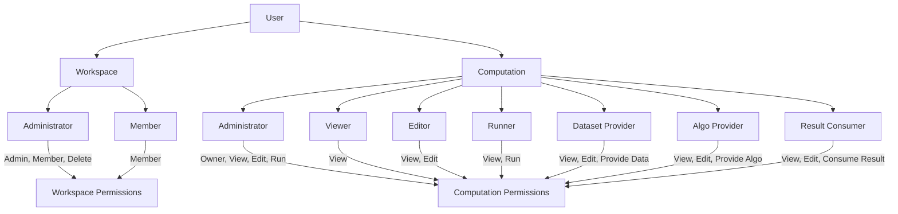

# Access Control

Prism implements fine grained access control for users having different access to the plaform.

## Workspaces

Workspaces are organizational units within the platform. They have the following user roles:

| Role          | Permissions                             |
|---------------|------------------------------------------|
| Administrator | Admin, Member, Delete                    |
| Member        | Member                                   |

### Workspaces Permissions Explained

- **Admin**: Full control over the workspace, including managing users and settings
- **Member**: Basic access to workspace resources
- **Delete**: Ability to delete the workspace

## Computations

Computations have more complex access control with various user roles:

| Role             | Permissions                                   |
|------------------|------------------------------------------------|
| Administrator    | Owner, View, Edit, Run                         |
| Viewer           | View                                           |
| Editor           | View, Edit                                     |
| Runner           | View, Run                                      |
| Dataset Provider | View, Edit, Provide Data                       |
| Algo Provider    | View, Edit, Provide Algo                       |
| Result Consumer  | View, Edit, Consume Result                     |

### Computation Permissions Explained

- **Owner**: Full control over the computation.
- **View**: Ability to see computation details
- **Edit**: Ability to modify computation settings
- **Run**: Ability to execute the computation
- **Provide Data**: Ability to input datasets for the computation
- **Provide Algo**: Ability to provide algorithms for the computation
- **Consume Result**: Ability to access and use computation results

## Important Notes

1. Workspace administrators automatically have admin permissions for computations within their workspace.
2. Platform administrators have admin permissions for all workspaces on the platform.
3. The access control system is designed to be flexible, allowing for fine-grained control over user permissions.
