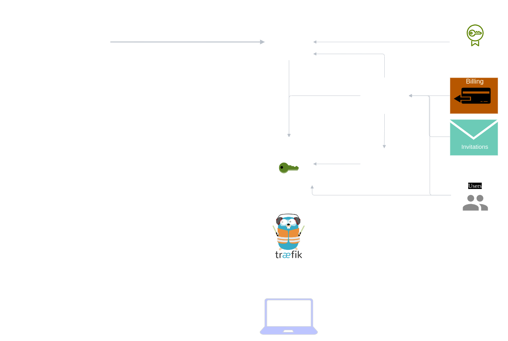

# Architecture

Prism provides a computation management service for [CoCos AI](https://docs.cocos.ultraviolet.rs/).

## Components

| Service        | Description                                                                                               |
| -------------- | --------------------------------------------------------------------------------------------------------- |
| Auth           | Manages user policies in relation to backends, certs and computations.                                    |
| Users          | Manages platform's users and auth concerns in regards to users and workspaces.                            |
| Computations   | Manages computation lifecycle, from creation to running and monitoring.                                   |
| Backends       | Manages connections to manager allowing running of computations on CoCos within secure enclaves.          |
| Certs          | Manages certification lifecyle (issuing, revocation, renewal) used for mTLS between backends and manager. |
| Billing        | Manages payments on the platform and controls resource access based on billing plans.                     |
| Invitations    | Manages user inivations to access workspaces.                                                             |
| User Interface | Provides an web interface to provide platform access over a visual interface.                             |

### Users

The users service provides users access to the plaform and the user identities are used to provide authorization for the platform. Prism uses [magistrala users](https://docs.magistrala.abstractmachines.fr/architecture/#domain-model) service to achieve this.

### Computations

The computations service give users with the appropriate authorization, the ability to create, update, delete and run computations.

### Backends

The backends service connects to the computations service and receives run requests from computations service which it forwards to manager service. Backends are identified by their ip addresses and have certificates assigned to them for mutual TLS connections with manager.

### Certs

This a certificate authority service that offers the ability to issue, revoke, renew certificates. It also offers an online certificate status protocal `OCSP` endpoint which is used to verify certificates used in backends service.

### User Interface

This provides users with a web interface to visually access the platform. It connects to the other services using the sdk.
