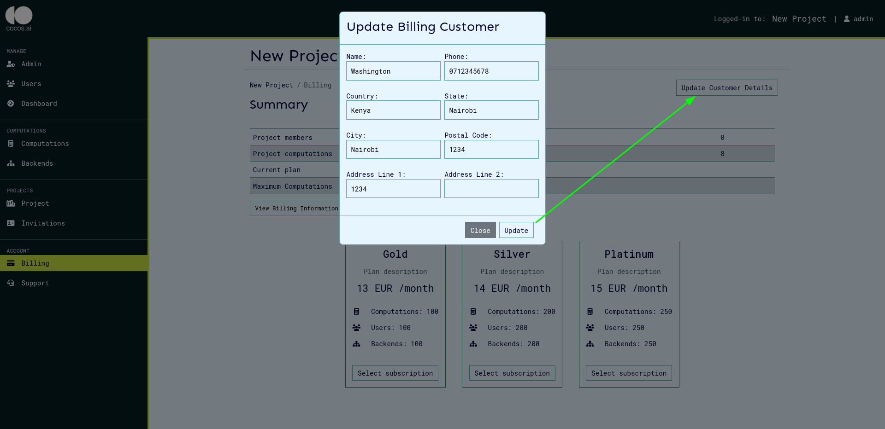
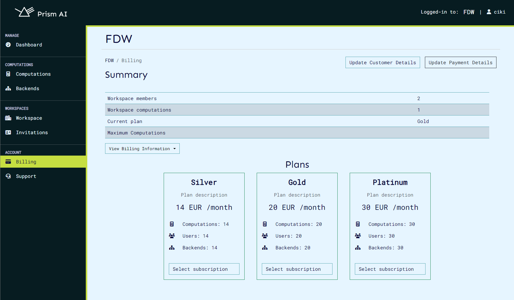
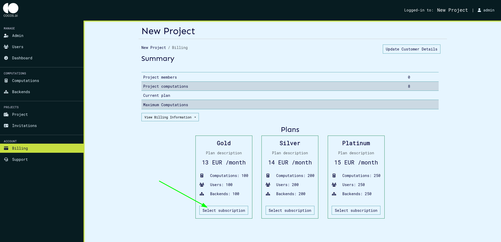
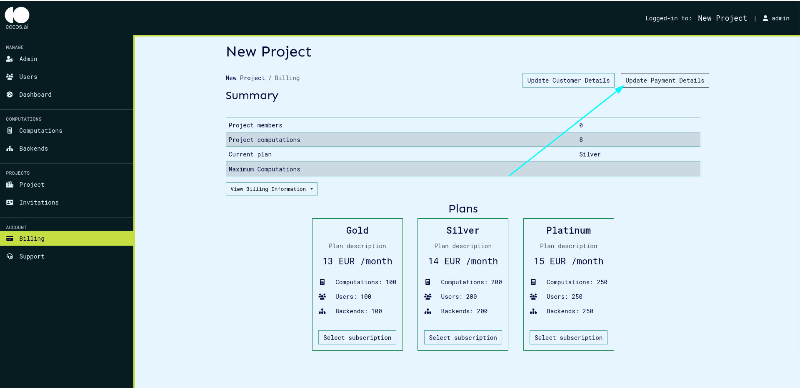

# Billing service

The billing service allows the project to pay for the services used in the CoCoS system such as total number of computations, total users, and the use rate. Once a billing customer is created, the billing service allows the user to select a plan out of the ones created by the admin and make payments for these plans based on the selected plan.

## Billing Metrics

Currently, billing plans are only based on the maximum number of computations that an project or user can have in the system. When an admin creates a plan, they limit the amount of computations that an project can have based on the amount paid by the user. This is still a work in progress and the actual metrics that should be limited will be changed based on internal discussions.

## Customer Functions

### Create Customer

This function allows for the creation of a new customer account with the billing service. A billing customer is required to perform all billing operations and is created from the project settings page as shown below.

Once you click the create billing customer, the customer details are required in order to successfully create the plan.

### Update Billing Customer

This function updates the details of an existing customer account.

## Subscription Functions

### Create Subscription

Once a billing customer has been created, the plans creted will be visible. On the projects settings page, the plan cards will be visible as shown below:

To subscribe to a plan, click the select subscription button which will create a subscription to the selected plan.

### Checkout

When the select subscription button is clicked, you will be redirected to the checkout page where your payment details will be required for the payment to be made.

If the payment is successful, you will be redirected to the projects page to proceed with your operations.

### Update Payment Details

The payment details of the current session are stored, and these can be changed by clicking the update payment details button as shown below:

