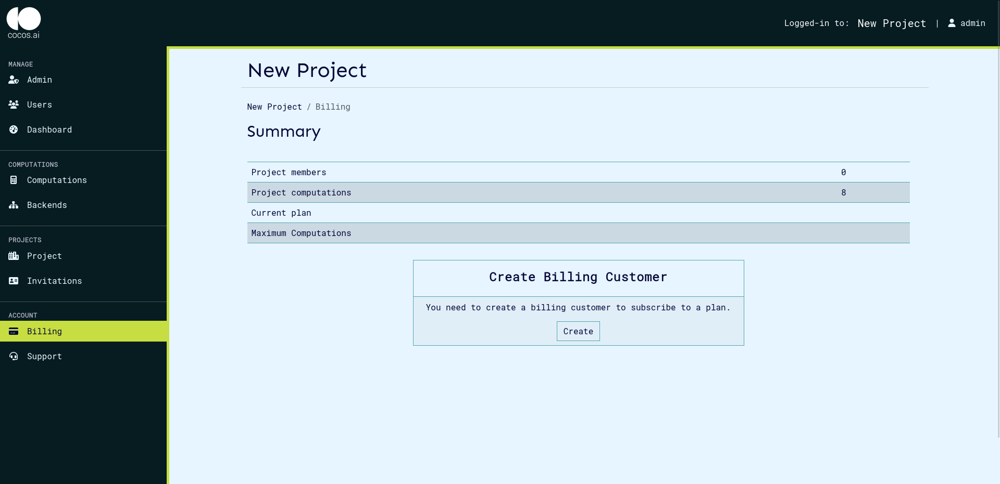
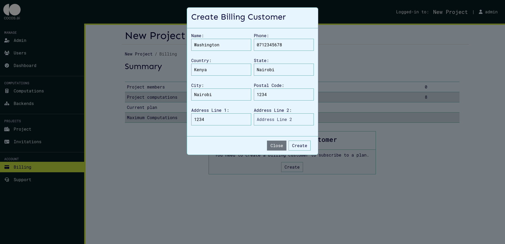
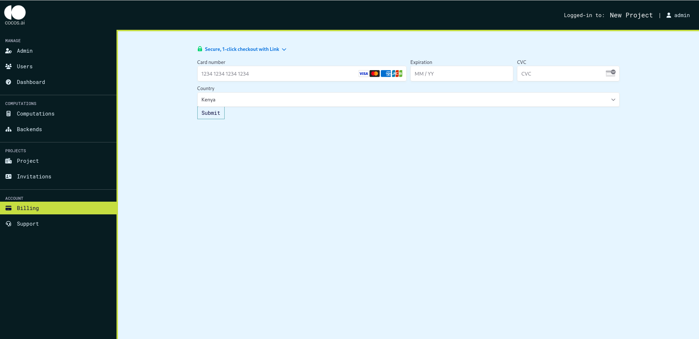

# Billing service

The billing service allows the project to pay for the services used in the CoCoS system such as total number of computations, total users, and the use rate. Once a billing customer is created, the billing service allows the user to select a plan out of the ones created by the admin and make payments for these plans based on the selected plan.

## Billing Metrics

Billing plans are designed for flexibility to accommodate different projects needs such as number of computations, workspace members and computation runs. This allows choice for a plan that best fits current projects needs and can easily scale up as needed.

## Customer Functions

### List Plans

In order to list plans, the following steps need to be followed:
On the UI the steps are as follows:

1. Click on 'Billing' on the side navigation to view the plans.
   

### Create Customer

This function allows for the creation of a new customer account with the billing service. A billing customer is required to perform all billing operations and is created from the billing page as shown below.

Once you click the create billing customer, the customer details are required in order to successfully create the plan.
On the UI the steps are as follows:

1. Click on 'Billing' on the side navigation, then click 'Create'
   
2. On the dialog that pops up, fill in the required details.
   

### Update Billing Customer

This function updates the details of an existing customer account.

On the UI the steps are as follows:

1. Click on 'Billing' on the side navigation, then click 'Update Customer Details'
   
2. On the dialog that pops up, fill in the required details and click 'Update'.
   

## Subscription Functions

### Create Subscription

Once a billing customer has been created, the plans created will be visible. On the billing page, the plan cards will be visible as shown below:

To subscribe to a plan, click the select subscription button which will create a subscription to the selected plan.

### Checkout

When the select subscription button is clicked, you will be redirected to the checkout page where your payment details will be required for the payment to be made.

On the UI the steps are as follows:

1. Click on 'Billing' on the side navigation, then click 'Select Subscription' on any of plans
   
2. On the checkout page, fill in your information and submit to check out.
   

### Update Payment Details

The payment details of the current session are stored, and these can be changed by clicking the update payment details button as shown below:

