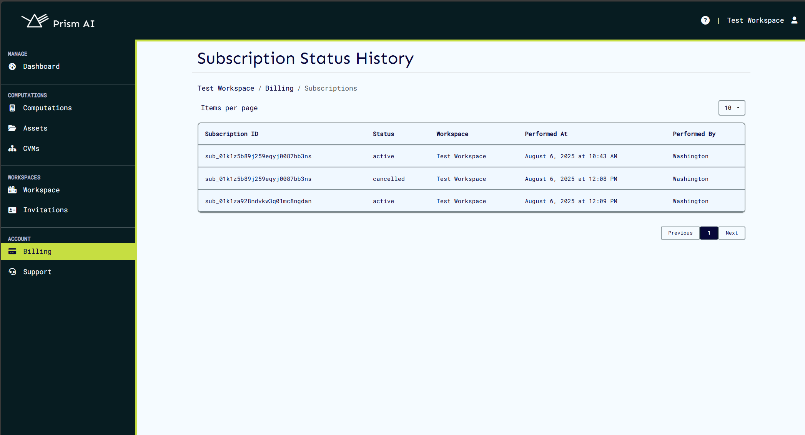

# Billing

To perform operations on the platform, a billing account has to be set up and a payment plan subscribed to. Available plans can be found on the [pricing page](https://docs.prism.ultraviolet.rs/#pricing).

## Setting up a billing account

To set up a billing account, follow these steps:

1. After registration to the platform and creating a workspace, navigate to the billing section on the sidebar.

2. The workspace settings page will look as shown below since no billing account has been set up yet.

3. To set up a billing account, click on the "Update Customer Details" button on the top right corner of the page.

4. This will open a form where you can enter your billing details. Fill in the required fields such as name, email, and address.

5. After filling in the details, click on the "Update" button to create your billing account. Available plans will be displayed on the page for the logged in user to choose from.

6. By default, the "Free" plan is selected. To change the plan, click on a different plan among the ones listed on the billing page.

7. After selecting a plan, you will be prompted to enter your payment details. Fill in the required fields for the payment method you choose (credit card, PayPal, etc.). 

8. Once you have entered your payment details, click on the "Subscribe Now" button to activate your subscription.

9. This should send you an email confirming your subscription. You can now use the platform with the selected plan.

10. If you ever need to change your billing details or update your payment method, you can return to the billing section and click on the "Update Customer Details" button again.

## Viewing Billing History

Billing history can be viewed in the billing section. This includes details of past transactions, invoices, and payment methods used.

### Subscription Management

To manage your subscription, go to the billing section and click on the "Manage Subscription" button. From there, you can view your current subscription, pause or resume it, and cancel if needed.

### Invoice Management

To manage your invoices, navigate to the billing section and click on the "Invoices" tab. Here you can view all your past invoices, download them as PDFs, and check the status of each invoice.

#### CVM Billing

Invoices for CVMs will be automatically generated and sent once each month. You can view these invoices in the "Invoices" tab of the billing section. Each invoice will detail the usage of CVMs and any associated costs.

Estimates of accrued costs for CVMs can be viewed in the CVMs page on the details of each CVM. This will give you an idea of the expected costs before the invoice is generated.

Pending payments on any CVMs will prevent you from logging in to the platform. Ensure that all invoices are paid to maintain access.

A list of unpaid invoices will be displayed on the workspaces page prior to logging in. Use the link on the invoice to pay it directly, and access the platform once the payment is confirmed.

### Payment Methods

To manage your payment methods, go to the billing section and click on the "View Payment Methods" button. Here you can view and remove any payment methods you no longer wish to use.

