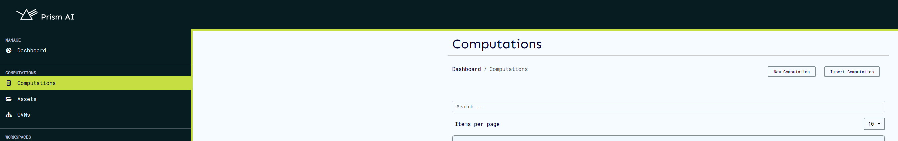
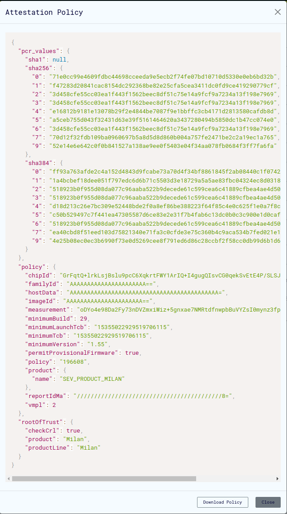

# Computations

## Overview

The computations service is the core component of Prism AI that enables secure, confidential AI workloads within Trusted Execution Environments (TEEs). Computations define collaborative AI workflows where multiple parties can contribute data, algorithms, and consume results while maintaining data privacy and security.

### What is a Computation?

A computation in Prism represents a secure collaborative AI workflow that includes:

- **Algorithm**: The AI model or processing logic to be executed
- **Datasets**: Input data from one or more providers  
- **Participants**: Users with specific roles (data providers, algorithm providers, result consumers)
- **Security Configuration**: TLS/mTLS settings and attestation policies
- **Execution Environment**: Virtual machine configuration for secure processing

## Quick Start

### Prerequisites

Before creating a computation, ensure you have:

- Access to a Prism workspace
- Appropriate user permissions for computation management
- Generated cryptographic keys for CLI operations (if needed)
- Required datasets and algorithms uploaded

### Creating Your First Computation

1. **Navigate to Computations**
   - Access the computations page from the sidebar
   - Click "Create New Computation"

2. **Configure Basic Details**
   - Enter computation name and description

3. **Set Security Configuration**
   - Configure agent security settings (TLS/mTLS/aTLS)
   - Upload necessary certificates if using TLS

4. **Review and Create**
   - Verify all settings in the computation manifest
   - Create the computation

## Computation Management

### Creating Computations

#### Web Interface

Access the computation creation interface through the main navigation:


**Required Information:**

- **Name**: Unique identifier for your computation
- **Description**: Clear explanation of the computation's purpose

#### Import from File

Prism supports bulk computation creation through file imports:

**Supported Formats:**

- **JSON**: Complete computation definition with all metadata
- **CSV**: Multiple computations in tabular format

**Import Process:**

1. Navigate to the computations page
2. Click the import button
3. Select your JSON or CSV file
4. Verify user IDs are valid and correspond to registered workspace users



**Sample JSON Format:**

```json
{
  "id": "185e61f4-2fd1-47c3-b8e7-1bf6a8466b79",
  "name": "sample_computation",
  "description": "Sample collaborative AI computation",
  "owner": "f07b7716-2737-4228-9d80-d9df4ab5ee53",
  "start_time": "0001-01-01T00:00:00Z",
  "datasets": [
    {
      "provider": "f07b7716-2737-4228-9d80-d9df4ab5ee53",
      "hash": "171ae99ff0449d52cd37f824eec20f56d4efbe322e022e1df02a89eabc16209c"
    }
  ],
  "algorithm": {
    "provider": "f07b7716-2737-4228-9d80-d9df4ab5ee53",
    "hash": "9567a45920974a3261f9e897b3da7e49a391728f607f36f0ad6e8f5ec8a2041b"
  },
  "result_consumers": ["f07b7716-2737-4228-9d80-d9df4ab5ee53"],
  "agent_config": {
    "log_level": "info",
    "cert_file": "",
    "server_key": "",
    "server_ca_file": "",
    "client_ca_file": "",
    "attested_tls": false
  },
  "backend_id": "9a8d67b6-9298-4393-81c6-8b7958a8cebf"
}
```

### Viewing Computations

#### List View

The computations page displays all computations you have access to:


**Available Actions:**

- View computation details
- Delete computations

#### Detailed View

Each computation provides comprehensive information and management options:


**Key Features:**

- **Computation Status**: Current execution state
- **Participant Information**: Roles and responsibilities
- **Configuration Details**: Security and logging settings
- **Action Buttons**: Run, edit, delete, view logs
- **Manifest Preview**: Complete computation definition

### Updating Computations

Modify existing computations through the update interface:


**Updatable Elements:**

- Basic metadata (name, description)
- Security configurations

**Important Notes:**

- Some fields cannot be modified after computation execution begins
- Configuration changes may require re-uploading certificates

### Exporting Computations

Export computations for backup, sharing, or migration:


**Export Options:**

- **JSON Format**: Complete computation definition with all metadata
- **Includes**: All configuration settings, participant information, and security policies

**Use Cases:**

- Creating computation templates
- Backup and disaster recovery  
- Migrating between environments
- Sharing computation configurations

## Agent Configuration

The Agent Config feature provides comprehensive security and operational settings for computational agents running in TEEs.

### Security Configuration Options

#### TLS Configuration Modes

Prism supports multiple TLS configurations to meet different security requirements:

1. No TLS

   - **Use Case**: Development and testing in isolated environments
   - **Security**: No encryption - not recommended for production
   - **Requirements**: None
   - **When to Use**: Only in completely trusted, air-gapped environments

2. TLS (Transport Layer Security)

   - **Use Case**: Standard encrypted communication
   - **Security**: Server authentication with encrypted channels
   - **Requirements**: Server certificate and private key
   - **When to Use**: Basic production deployments with trusted networks

3. Mutual TLS (mTLS)

   - **Use Case**: High-security environments requiring bi-directional authentication
   - **Security**: Both client and server authentication
   - **Requirements**: Client and server certificates, CA certificates for both parties
   - **When to Use**: Production environments with strict security requirements

4. Attested TLS (aTLS)

   - **Use Case**: TEE-based attestation with encrypted communication
   - **Security**: Hardware-backed attestation during TLS handshake
   - **Requirements**: Attestation policy file
   - **When to Use**: Confidential computing environments requiring hardware attestation

5. Mutual Attested TLS (maTLS)

   - **Use Case**: Maximum security with mutual authentication and attestation
   - **Security**: Combines mTLS and aTLS for highest security level
   - **Requirements**: All mTLS certificates plus attestation policy
   - **When to Use**: Mission-critical confidential computing workloads

### Agent Configuration Interface


#### Configuration Steps

1. **Access Configuration**
   - Select appropriate TLS configuration mode on the computation creation/update page

2. **Upload Certificates** (if required)
   - Ensure all files are in PEM format
   - Verify certificate validity and expiration dates
   - Confirm proper file permissions

3. **Set Logging Level**
   - Choose appropriate verbosity for your use case
   - Consider performance impact of debug logging

4. **Save Configuration**
   - Update or create the computation

### Certificate Requirements

#### File Formats and Purposes

| File Type | Required For | Format | Purpose |
|-----------|-------------|---------|----------|
| Key File | TLS, mTLS | PEM-encoded private key | Agent authentication |
| Certificate File | TLS, mTLS | PEM-encoded certificate | Agent identity verification |
| Server CA File | mTLS only | PEM-encoded CA certificate | Server certificate verification |
| Client CA File | mTLS, maTLS | PEM-encoded CA certificate | Client certificate verification |

#### Generating Certificates

For development and testing environments, you can generate self-signed certificates:

```bash
# Set variables
CLIENT_ORG_UNIT="example_prism_cli"
SERVER_ORG_UNIT="example_prism_agent"
WORK_DIR="/path/to/certificates"

# 1. Generate CA's private key and self-signed certificate
openssl req -x509 -sha256 -newkey rsa:4096 -days 365 -nodes \
    -keyout "$WORK_DIR/ca-key.pem" \
    -out "$WORK_DIR/ca-cert.pem" \
    -subj "/CN=Example_CA/O=ExampleOrg/OU=example_ca/emailAddress=info@example.com"

# 2. Generate server's private key and certificate signing request
openssl req -newkey rsa:4096 -sha256 -nodes \
    -keyout "$WORK_DIR/server-key.pem" \
    -out "$WORK_DIR/server-req.pem" \
    -subj "/CN=Example_Server/O=ExampleOrg/OU=$SERVER_ORG_UNIT/emailAddress=info@example.com"

# 3. Sign server certificate
openssl x509 -req -in "$WORK_DIR/server-req.pem" -days 365 \
    -CA "$WORK_DIR/ca-cert.pem" \
    -CAkey "$WORK_DIR/ca-key.pem" \
    -CAcreateserial \
    -out "$WORK_DIR/server-cert.pem" \
    -extfile "$WORK_DIR/ext/server-ext.cnf" \
    -extensions v3_req

# 4. Generate client certificates (for mTLS)
openssl req -newkey rsa:4096 -sha256 -nodes \
    -keyout "$WORK_DIR/client-key.pem" \
    -out "$WORK_DIR/client-req.pem" \
    -subj "/CN=Example_Client/O=ExampleOrg/OU=$CLIENT_ORG_UNIT/emailAddress=info@example.com"

openssl x509 -req -in "$WORK_DIR/client-req.pem" -days 365 \
    -CA "$WORK_DIR/ca-cert.pem" \
    -CAkey "$WORK_DIR/ca-key.pem" \
    -CAcreateserial \
    -out "$WORK_DIR/client-cert.pem" \
    -extfile "$WORK_DIR/ext/client-ext.cnf" \
    -extensions v3_req
```

**Certificate Extension File Example:**

```ini
[req]
req_extensions = v3_req
distinguished_name = req_distinguished_name

[req_distinguished_name]

[v3_req]
basicConstraints = CA:FALSE
keyUsage = nonRepudiation, digitalSignature, keyEncipherment
subjectAltName = @alt_names

[alt_names]
DNS.1 = localhost
DNS.2 = <agent_hostname>
IP.1 = <agent_ip_address>
```

### Logging Configuration

#### Log Levels

- Info (Recommended)

   - Standard operational information
   - Important events and milestones
   - Balanced detail without performance impact
   - **Best for**: Production environments

- Debug

   - Detailed operation information
   - Extensive diagnostic data
   - May impact performance
   - **Best for**: Development and troubleshooting

- Warn

   - Warning-level messages only
   - Potentially harmful situations
   - Minimal operational information
   - **Best for**: Monitoring potential issues

- Error

   - Critical issues only
   - Error conditions and failures
   - Minimal logging overhead
   - **Best for**: Production with minimal logging requirements

#### Best Practices

- **Production**: Use "Info" level for normal operations
- **Development**: Enable "Debug" temporarily for troubleshooting
- **Monitoring**: Use "Warn" to focus on potential issues
- **Minimal Overhead**: Use "Error" when logging must be minimal

## Security Configuration Examples

### Attested TLS (aTLS) Setup

Attested TLS provides hardware-backed attestation for TEE environments:

#### Configuration Steps

1. **Set aTLS Configuration**
   
   - Select "Attested TLS" from the TLS Configuration dropdown
   - No certificate files required
   - Click "Close" to save

2. **Verify Configuration**
   
   - Update/create the computation
   - Verify aTLS is properly configured

3. **Run Computation**
   - Create a CVM
   - Wait for VM provisioning to complete
   - Start the computation

   

4. **Download Attestation Policy**

   
   - Download the attestation policy file from the cvm page
   - This file contains expected values for attestation verification

5. **Configure CLI Environment**

   ```bash
   export AGENT_GRPC_URL=<backend_host>:<agent_port>
   export AGENT_GRPC_ATTESTED_TLS=true
   export AGENT_GRPC_ATTESTATION_POLICY=<path_to_attestation_policy_file>
   ```

#### Advanced aTLS Configuration

**Manual Measurement Calculation** (Optional)

For additional security verification, you can manually calculate and verify measurements:

```bash
# Set paths to kernel and rootfs files
OVMF_CODE=/path/to/ovmf/OVMF.fd
INITRD="/path/to/rootfs.cpio.gz"
KERNEL="/path/to/bzImage"
LINE='"quiet console=null rootfstype=ramfs"'

# Calculate expected measurement
./cocos-cli sevsnpmeasure --mode snp --vcpus 4 --vcpu-type EPYC-v4 \
    --ovmf $OVMF_CODE --kernel $KERNEL --initrd $INITRD --append "$LINE"

# Update attestation policy with calculated measurement
./cocos-cli backend measurement <base64-measurement> <attestation_policy.json>
```

### TLS and mTLS Configuration

#### TLS Setup (Server Authentication)

**UI Configuration:**

1. Select "TLS" from TLS Configuration dropdown
2. Upload server certificate and private key files
3. Configure CLI environment:

```bash
export AGENT_GRPC_URL=<backend_host>:<agent_port>
export AGENT_GRPC_SERVER_CA_CERTS=<path_to_ca_cert>
```

#### mTLS Setup (Mutual Authentication)


**UI Configuration:**

1. Select "Mutual TLS" from TLS Configuration dropdown  
2. Upload all required certificate files:
   - Server certificate and private key
   - Client CA certificate
   - Server CA certificate

**CLI Configuration:**

```bash
export AGENT_GRPC_URL=<backend_host>:<agent_port>
export AGENT_GRPC_CLIENT_CERT=<path_to_client_cert>
export AGENT_GRPC_CLIENT_KEY=<path_to_client_key>
export AGENT_GRPC_SERVER_CA_CERTS=<path_to_server_ca_cert>
```

#### maTLS Setup (Mutual Attested TLS)

Combines mTLS and aTLS for maximum security:

**CLI Configuration:**

```bash
# mTLS settings
export AGENT_GRPC_URL=<backend_host>:<agent_port>
export AGENT_GRPC_CLIENT_CERT=<path_to_client_cert>
export AGENT_GRPC_CLIENT_KEY=<path_to_client_key>
export AGENT_GRPC_SERVER_CA_CERTS=<path_to_server_ca_cert>

# aTLS settings  
export AGENT_GRPC_ATTESTED_TLS=true
export AGENT_GRPC_ATTESTATION_POLICY=<path_to_attestation_policy>
```

### Security Architecture

#### TLS Communication Flow


1. CLI connects to Agent
2. Agent presents server certificate
3. CLI verifies certificate against CA
4. Encrypted communication channel established

#### mTLS Communication Flow


1. CLI connects to Agent
2. Agent presents server certificate
3. CLI verifies server certificate
4. CLI presents client certificate
5. Agent verifies client certificate
6. Mutual authentication complete, encrypted channel established

## Computation Operations

### Running Computations

#### Prerequisites

- Computation must be properly configured
- Target CVM must be available and ready
- Proper authentication configured (keys, certificates)

#### Execution Process

1. **Initiate Execution**
   - Click "Run" button on computation page
   - Select target virtual machine
   - Confirm execution parameters

2. **Monitor Progress**
   - Track VM provisioning status
   - Monitor computation logs for progress
   - Check for any error conditions

3. **Handle Results**
   - Results available to designated consumers
   - Download through CLI
   - Verify result integrity

#### VM Requirements

- **Status**: VM must be in "Ready" state
- **Resources**: Sufficient CPU, memory, and storage
- **Network**: Proper connectivity to agent services
- **Security**: Compatible with computation's security configuration

### Managing Computation Lifecycle

#### Computation States

| State | Description | Available Actions |
|-------|-------------|-------------------|
| Running | Currently executing | Monitor, View Logs |
| Completed | Successfully finished | View Results, Download |
| Failed | Execution failed | View Logs, Retry, Edit |
| Cancelled | Manually stopped | View Logs, Edit, Retry |

#### Monitoring and Troubleshooting

- Viewing Logs

   - Access computation logs through the computation detail page
   - Monitor real-time execution progress
   - Identify error conditions and debugging information

- Common Issues and Solutions

| Issue | Symptom | Solution |
|-------|---------|----------|
| Certificate Errors | Authentication failures | Verify certificate validity and configuration |
| Network Issues | Connection timeouts | Check firewall rules and network connectivity |
| Resource Constraints | Performance issues | Monitor resource usage, scale VM if needed |

### Deleting Computations

**Important Considerations:**

- Deletion is permanent and cannot be undone
- All associated data and results will be removed
- Consider exporting important computations before deletion

## User Key Management

### Cryptographic Key System

Prism implements a robust public-key cryptography system for user authentication and role management in multiparty confidential computing.

#### Key Characteristics

- **Single Key Pair**: Each user needs only one public-private key pair per computation
- **Multi-Role Support**: Same key pair works for all roles within a computation
- **Security Types**: Support for RSA, ECDSA, and Ed25519 key algorithms

### Key Usage Workflow

#### Registration Phase

1. **Generate Key Pair**
   - Use CLI tools to generate cryptographic keys
   - Follow [key generation guide](https://docs.cocos.ultraviolet.rs/cli/#generate-keys)

2. **Register Public Key**
   
   - Upload public key when assigned to computation
   - System associates key with all designated roles

3. **Verify Registration**
   - Check computation manifest for key association
   - Confirm all roles are properly linked to your key

#### Operation Phase

Use the same private key for all CLI operations:

- [Algorithm uploads](https://docs.cocos.ultraviolet.rs/cli/#upload-algorithm)
- [Dataset uploads](https://docs.cocos.ultraviolet.rs/cli/#upload-dataset)  
- [Result retrieval](https://docs.cocos.ultraviolet.rs/cli/#retrieve-result)

### Security Best Practices

#### Private Key Management

- **Never Share**: Private keys must remain confidential
- **Secure Storage**: Use encrypted storage and proper file permissions
- **Backup Strategy**: Maintain secure backups of private keys
- **Access Control**: Limit access to private key files

#### Public Key Distribution

- **Safe to Share**: Public keys can be freely distributed
- **Manifest Verification**: Check computation manifest to verify key registration
- **Role Validation**: Ensure all intended roles are associated with your key


#### Operational Security

- **Key Rotation**: Consider regular key rotation for long-term computations
- **Workspace Separation**: Use different keys for different workspaces
- **Computation Isolation**: Consider separate keys for high-security computations

## Troubleshooting

### Common Issues

#### Certificate and TLS Problems

##### Certificate Validation Errors

- **Symptoms**: Authentication failures, TLS handshake errors
- **Solutions**:
  - Verify certificate chain validity and expiration dates
  - Check file permissions and formats (must be PEM)
  - Ensure certificate-key pair matching

##### Connection Problems

- **Symptoms**: Connection timeouts, network errors
- **Solutions**:
  - Verify network connectivity between CLI and agent
  - Confirm firewall rules allow TLS traffic on required ports
  - Check agent service status and availability
  - Restart computation if necessary
  - Create a new cvm

#### Attestation Issues

##### aTLS Configuration Problems

- **Symptoms**: Attestation verification failures
- **Solutions**:
  - Verify attestation policy file is correctly downloaded
  - Check measurement calculations match expected values
  - Validate TEE hardware compatibility

#### Computation Execution Issues

##### Data Upload Problems

- **Symptoms**: CLI operations fail, data not accessible
- **Solutions**:
  - Verify key configuration and authentication
  - Check network connectivity to agent
  - Confirm role permissions for data operations

### Getting Help

#### Log Analysis

- Enable debug logging for detailed troubleshooting information
- Check computation logs
- Monitor computation events

#### Support Resources

- [COCOS CLI Documentation](https://docs.cocos.ultraviolet.rs/cli/)
- [Attestation Guide](https://docs.cocos.ultraviolet.rs/attestation/)
- Community support and issue tracking

#### Performance Optimization

- Monitor resource usage during computation execution
- Optimize logging levels for production environments
- Consider VM scaling for resource-intensive computations

## Best Practices

### Security

- Always use appropriate TLS configuration for your environment
- Regularly rotate cryptographic keys
- Monitor and audit computation access
- Keep certificates and keys secure

### Operations

- Use descriptive names and documentation for computations
- Implement proper backup and export strategies
- Monitor computation performance and resource usage
- Maintain organized workspace and role management

### Development

- Test computations in development environments first
- Use debug logging during development and testing
- Validate all configurations before production deployment
- Implement proper error handling and monitoring
