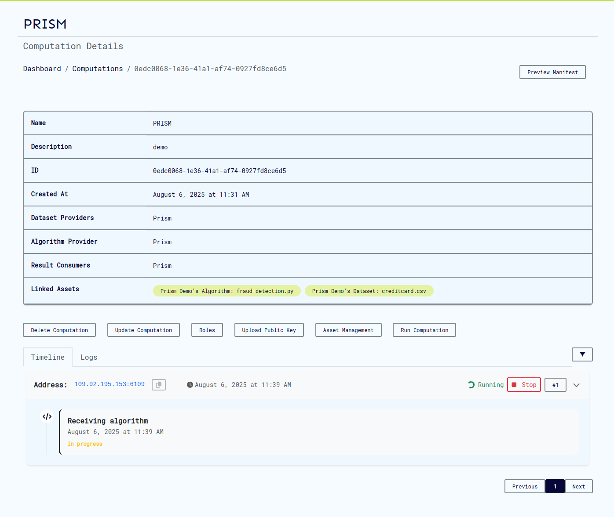
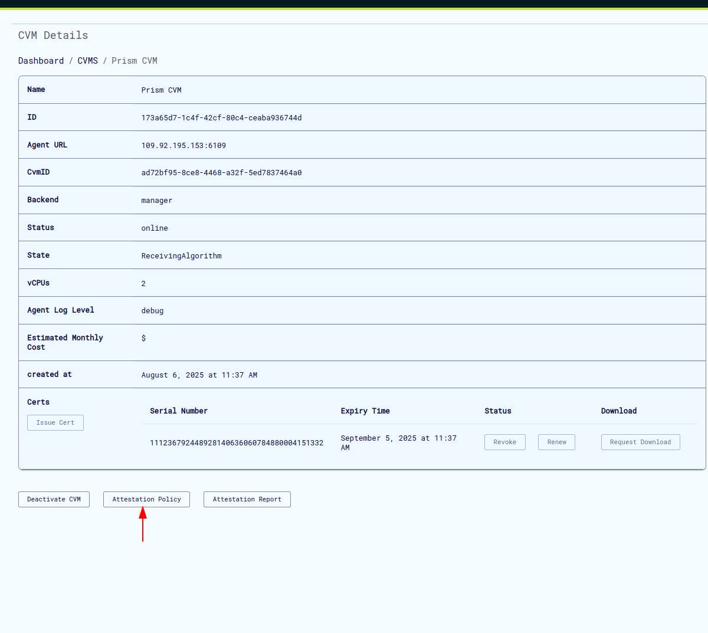
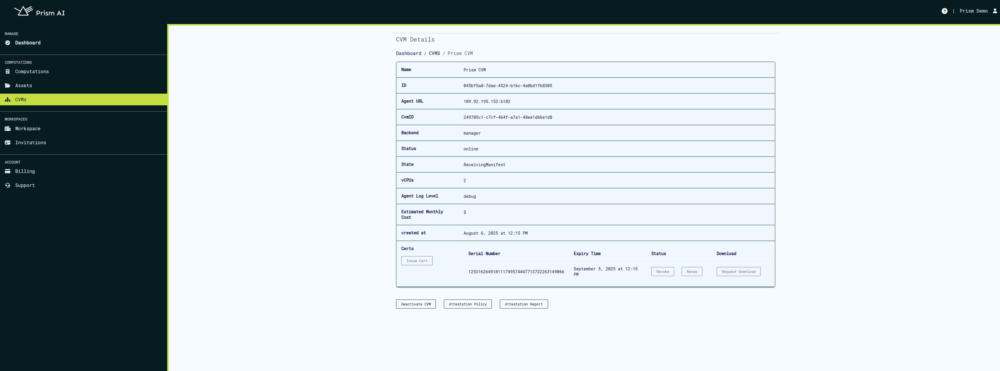
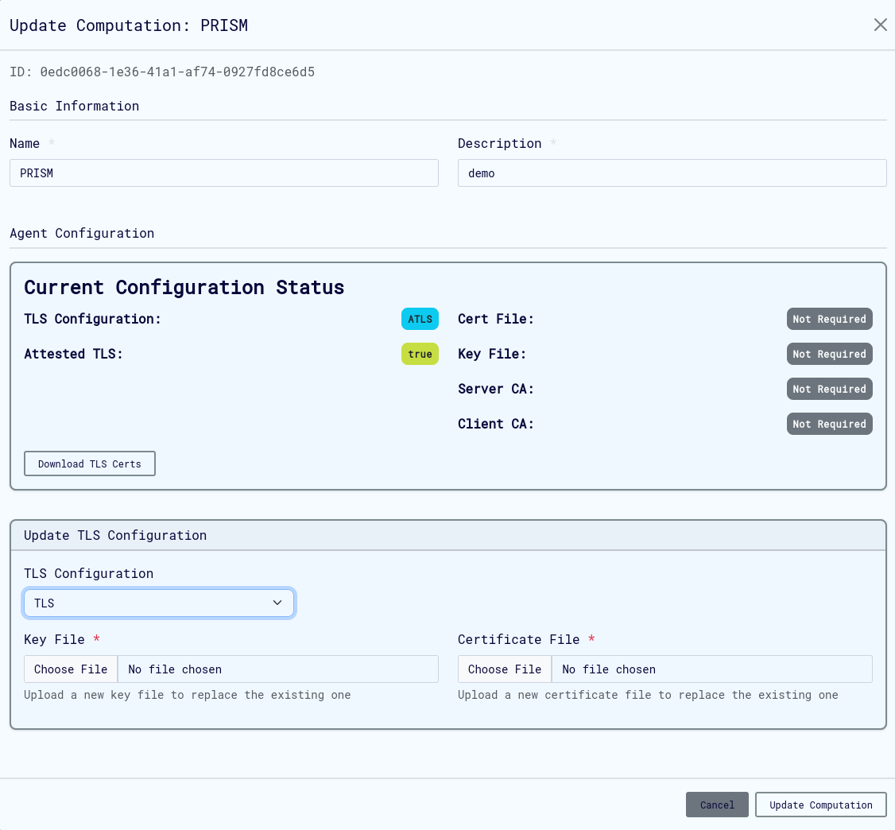
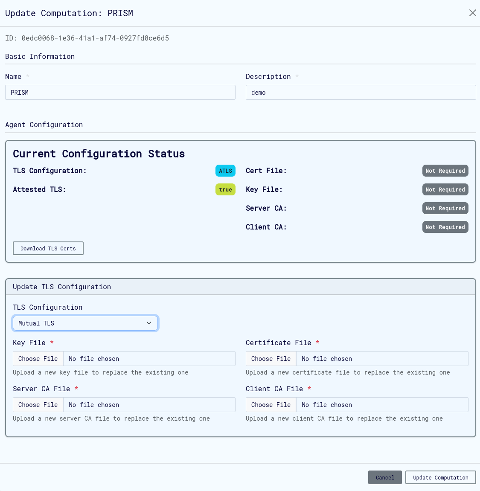
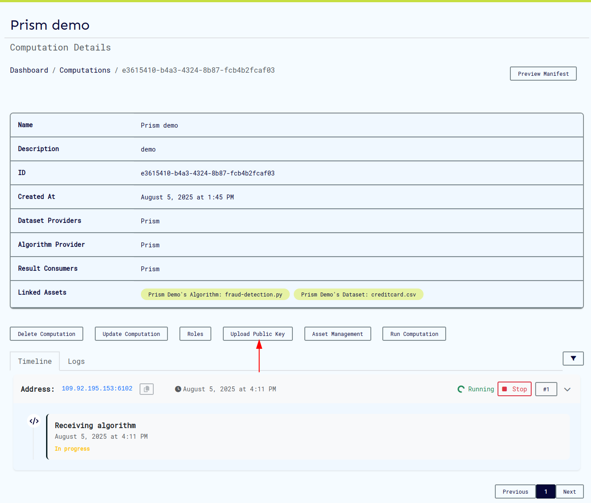

# Computations

The computations service provides a means to manage computations, with functions such as computation creation, update, deletion, and running.

## Add Computation

On the ui this can be done on this page as shown here


### Agent Configuration

The Agent Config feature allows users to configure TLS (Transport Layer Security) settings and logging levels for computational agents. This configuration is accessible through the Agent Config modal in the New Computation interface.

#### TLS Configuration Options

The system supports four TLS configuration modes:

1. No TLS
   - Disables TLS security
   - No additional configuration required
   - Should only be used in secure, isolated environments
   - Not recommended for production deployments

2. TLS
   - Standard TLS configuration
   - Required files:
     - Key File
     - Certificate File
   - Suitable for environments requiring encrypted communication without mutual authentication

3. Mutual TLS
   - Requires bi-directional authentication
   - Required files:
     - Key File
     - Certificate File
     - Server CA File
     - Client CA File
   - Provides highest level of security with mutual authentication

4. Attested TLS
   - Basic TLS configuration with attestation verification during the TLS handshake.
   - No additional certificate or key files required.
   - Suitable for environments requiring basic secure communication.

5. Mutual Attested TLS
   - A combination of Mutual TLS and Attested TLS.
   - Required files:
     - Client CA File

#### Log Level Configuration

- **Info**: Standard logging level for general operational information
  - Logs important events and milestones
  - Recommended for normal operation
  - Provides good balance of information without excessive detail

- **Debug**: Detailed logging for troubleshooting
  - Includes extensive operation details
  - Useful during development and debugging
  - May impact performance

- **Warn**: Warning-level messages only
  - Logs potentially harmful situations
  - Does not log normal operational information
  - Useful for monitoring potential issues

- **Error**: Critical issues only
  - Logs only error conditions
  - May miss important operational information

##### Best practices for log levels

- Use Info for normal operations
- Enable Debug temporarily for troubleshooting
- Use Error only when minimal logging is required

#### File Requirements

##### Key File

- Required for: Mutual TLS, TLS
- Format: PEM-encoded private key
- Purpose: Authentication of the agent

##### Certificate File

- Required for: Mutual TLS, TLS
- Format: PEM-encoded certificate
- Purpose: Identity verification of the agent

##### Server CA File

- Required for: Mutual TLS only
- Format: PEM-encoded CA certificate
- Purpose: Verification of server certificates

##### Client CA File

- Required for: Mutual TLS and Mutual Attested TLS
- Format: PEM-encoded CA certificate
- Purpose: Verification of client certificates

#### Implementation Steps


1. Access the Agent Config modal through the "Enter Agent Config" button on create/update computation page.
2. Select appropriate TLS Configuration mode
3. Set desired Log Level based on operational requirements
4. For TLS, Mutual TLS or Mutual Attested TLS modes:
   - Upload required certificate and key files
   - Verify file formats and permissions
5. Click "Close" to save configuration

#### Troubleshooting

Common issues and solutions:

##### Certificate Issues

- Verify certificate chain validity
- Check certificate expiration dates
- Ensure proper file permissions

##### Connection Problems

- Verify all required files are properly uploaded
- Check network connectivity
- Confirm firewall rules allow TLS traffic
- Restart the computation

##### Authentication Failures

- Verify certificate-key pairs match
- Check CA trust chain
- Confirm client/server certificate compatibility

#### Example: Attestated TLS configuration

Agent can be configured to run with [attested TLS](https://docs.cocos.ultraviolet.rs/attestation/#attested-tls).

1. Set agent tls configuration to aTLS. 
   Click on close to save config and click the update/create button to save the computation.
2. To confirm aTLS was configured, click on the update computation button.
   
3. Next Run the computation and wait for the virtual machine provisioning to be complete.
   
4. Download the attestation policy. This file is used to set the expected values in the attestation report and is required for validation.
   
   

5. Finally to connect to agent, we need to configure the env variables on cli.

```shell
export AGENT_GRPC_URL=<backend_host>:<agent_port>
export AGENT_GRPC_ATTESTED_TLS=true
export AGENT_GRPC_ATTESTATION_POLICY=<path_to_attestation_policy_file>
```

after this configuration you can connect to agent normally using cli and perform [operations](https://docs.cocos.ultraviolet.rs/cli/) on cli such as algo/data upload etc.

##### Calculating measurement manually (optional)

Optionally, you can calculate and confirm the measurement in the attestation report. You'll need the kernel and rootfs file which can be downloaded from cocos releases based on versions.



to calculate the expected measurement:

```shell
OVMF_CODE=/home/cocosai/danko/test/ovmf/OVMF.fd
INITRD="/home/sammy/rootfs.cpio.gz"
KERNEL="/home/sammy/bzImage"
LINE='"quiet console=null rootfstype=ramfs"'
./build/cocos-cli sevsnpmeasure --mode snp --vcpus 4 --vcpu-type EPYC-v4 --ovmf $OVMF_CODE --kernel $KERNEL --initrd $INITRD --append "$LINE"
```

Once calculated this can be replaced on the attestation policy file using:

```shell
./build/cocos-cli backend measurement <base64-string-of-measurement> <attestation_policy.json file>
```

##### Calculating the host-data (Optional)

The host data set on the virtual machine is based on the computation mmanifest. The manifest should be downloaded from the computation page. Click on preview manifest and then download the manifest for the specific computation run.


The host data value us calculated using the cli as below:

```shell
./build/cocos-cli checksum <path-to-manifest-json-file> --manifest -b
```

This can also be edited into the downloaded attestation policy as below:

```shell
./build/cocos-cli backend hostdata <base64-string-of-measurement> <attestation_policy.json file>
```

#### Example: mTLS and TLS configuration

To ensure secure communications, prevent unauthorized access, data interception, and man-in-the-middle (MITM) attacks in Prism and COCOS Transport Layer Security (TLS) and Mutual TLS (mTLS) features can be enabled as described above.
TLS/ mTLS configurations ensures that:

- Algorithms and Datasets uploaded to Agent and Results downloaded from agent through the CLI remains private.
- The integrity of data is preserved (i.e., no tampering).
- The Agent's identity is verified through a server certificate either issued by a trusted Certificate Authority (CA) or self-signed

For TLS connection:

1. The CLI connects to the Agent.
2. Agent shows its certificate to the CLI.
3. CLI verifies that certificate.
4. CLI sends data to the Agent in an encrypted communication channel.


For MTLS connection:

1. CLI connects to the Agent.
2. Agent shows its certificate to the CLI.
3. CLI verifies that certificate.
4. CLI shows its certificate to the Agent.
5. Agent verifies that certificate and allows the CLI to send requests.
6. CLI sends data to the Agent in an encrypted communication channel.


To generate your own certificates for configuring either of the modes:

```bash
CLIENT_ORG_UNIT="example_prism_cli"
SERVER_ORG_UNIT="example_prism_agent"
WORK_DIR=""

# 1. Generate CA's private key and self-signed certificate
openssl req -x509 -sha256 -newkey rsa:4096 -days 365 -nodes -keyout  "$WORK_DIR/ca-key.pem" -out "$WORK_DIR/ca-cert.pem" -subj "/CN=Example_Selfsigned_ca/O=ExampleOrg/OU=example_ca/emailAddress=info@example.com"

echo "CA's self-signed certificate"
openssl x509 -in "$WORK_DIR/ca-cert.pem" -noout -text

# 2. Generate server's private key and certificate signing request (CSR)
openssl req -newkey rsa:4096  -sha256 -nodes -keyout  "$WORK_DIR/server-key.pem" -out  "$WORK_DIR/server-req.pem" -subj "/CN=Example_Selfsigned/O=ExampleOrg/OU=$SERVER_ORG_UNIT/emailAddress=info@example.com"

# 3. Use CA's private key to sign web server's CSR and get back the signed certificate
openssl x509 -req -in "$WORK_DIR/server-req.pem" -days 365 -CA "$WORK_DIR/ca-cert.pem" -CAkey  "$WORK_DIR/ca-key.pem" -CAcreateserial -out  "$WORK_DIR/server-cert.pem" -extfile "$WORK_DIR/ext/server-ext.cnf" -extensions v3_req

echo "Server's signed certificate"
openssl x509 -in "$WORK_DIR/server-cert.pem" -noout -text

# For mTLS
# 4. Generate client's private key and certificate signing request (CSR)
openssl req -newkey rsa:4096 -sha256 -nodes -keyout "$WORK_DIR/client-key.pem" -out "$WORK_DIR/client-req.pem" -subj "/CN=Example_Selfsigned/O=ExampleOrg/OU=$CLIENT_ORG_UNIT/emailAddress=info@example.com"

# 5. Use CA's private key to sign client's CSR and get back the signed certificate
openssl x509 -req -in "$WORK_DIR/client-req.pem" -days 365 -CA "$WORK_DIR/ca-cert.pem" -CAkey "$WORK_DIR/ca-key.pem" -CAcreateserial -out "$WORK_DIR/client-cert.pem" -extfile "$WORK_DIR/ext/client-ext.cnf" -extensions v3_req

echo "Client's signed certificate"
openssl x509 -in "$WORK_DIR/client-cert.pem" -noout -text
```

Example extension file:

```text
[req]
req_extensions = v3_req
distinguished_name = req_distinguished_name

[req_distinguished_name]

[v3_req]
basicConstraints = CA:FALSE
keyUsage = nonRepudiation, digitalSignature, keyEncipherment
subjectAltName = @alt_names

[alt_names]
DNS.1 = localhost
DNS.2 = <agent host name>

# IP addresses
IP.1 = <agent host ip>
```

To configure TLS for agent on the ui:

1. Access the Agent Config modal through the "Enter Agent Config" button on create/update computation page.
2. Select the TLS option from the TLS Configuration drop down.



To configure mTLS for agent on the ui:

1. Access the Agent Config modal through the "Enter Agent Config" button on create/update computation page.
2. Select the mTLS option from the TLS Configuration drop down.



To connect cli to agent, we need to configure the env variables on cli.

For mTLS:

```bash

export AGENT_GRPC_URL=<backend_host>:<agent_port>
export AGENT_GRPC_CLIENT_CERT=<path_to_generated_client_cert>
export AGENT_GRPC_CLIENT_KEY=<path_to_generated_client_key>
export AGENT_GRPC_SERVER_CA_CERTS=<path_to_generated_server_ca_cert>
```

For TLS:

```bash
export AGENT_GRPC_URL=<backend_host>:<agent_port>
export AGENT_GRPC_SERVER_CA_CERTS=<path_to_generated_server_ca_cert>
```

After this configuration you can connect to agent normally using cli and perform [operations](https://docs.cocos.ultraviolet.rs/cli/) on cli such as algo/data upload etc.

It is important to note that the Agent is the server and cli the client. Therefore, upload server generated cert, key on the UI as shown above and configure certificates generated for client on CLI.

#### Example: maTLS configuration

Mutual Attested TLS works like mTLS with the addition of the attestation report. To configure maTLS follow the steps for mTLS. To connect cli to agent with maTLS, we need to configure the following superset of env variables on cli (mTLS + aTLS env variables).

```bash

export AGENT_GRPC_URL=<backend_host>:<agent_port>
export AGENT_GRPC_CLIENT_CERT=<path_to_generated_client_cert>
export AGENT_GRPC_CLIENT_KEY=<path_to_generated_client_key>
export AGENT_GRPC_SERVER_CA_CERTS=<path_to_generated_server_ca_cert>
export AGENT_GRPC_ATTESTED_TLS=true
export AGENT_GRPC_ATTESTATION_POLICY=<path_to_attestation_policy_file>
```

After this configuration you can connect to agent normally using cli and perform operations on cli such as algo/data upload etc.

## Retrieve Computations

Computations are listed on the computations page, which can be accessed from the sidebar.


## Retrieve Computation Information

The view computation page appears as below, it also contains buttons to edit, run, delete and view computation logs and events.


## Update Computations Information

The update computation page appears as below:


## Computation export and import

Prism allows users to export and import computations in both JSON and CSV formats. When exporting as JSON, all details of a computation are bundled into a single file, which can later be imported to recreate the computation with the provided data. Alternatively, multiple computations can be uploaded using a CSV file, which contains the relevant details for each computation. You can find a sample CSV file in the Prism repository [here](https://github.com/ultravioletrs/prism/blob/main/sample_computations.csv). When importing computations, ensure that all user IDs included in the file are valid and correspond to registered users in the workspace, including both backend and user IDs.

A sample computation that can be uploaded as json is shown:

```json
{
  "id": "185e61f4-2fd1-47c3-b8e7-1bf6a8466b79",
  "name": "sample_computation",
  "description": "sample",
  "owner": "f07b7716-2737-4228-9d80-d9df4ab5ee53",
  "start_time": "0001-01-01T00:00:00Z",
  "datasets": [
    {
      "provider": "f07b7716-2737-4228-9d80-d9df4ab5ee53",
      "hash": "171ae99ff0449d52cd37f824eec20f56d4efbe322e022e1df02a89eabc16209c"
    },
    {
      "provider": "f07b7716-2737-4228-9d80-d9df4ab5ee53",
      "hash": "3b8aea5a74d179a445e86ce23d2fc24c8cd65d34f19798cb8852a7bcf945b2ae"
    },
    {
      "provider": "f07b7716-2737-4228-9d80-d9df4ab5ee53",
      "hash": "64a6eb1ed400d9b8139d64ef21641e0a930cda8008e21d2b055f1ae91a2c710a"
    }
  ],
  "algorithm": {
    "provider": "f07b7716-2737-4228-9d80-d9df4ab5ee53",
    "hash": "9567a45920974a3261f9e897b3da7e49a391728f607f36f0ad6e8f5ec8a2041b"
  },
  "result_consumers": ["f07b7716-2737-4228-9d80-d9df4ab5ee53"],
  "agent_config": {
    "log_level": "debug",
    "cert_file": "",
    "server_key": "",
    "server_ca_file": "",
    "client_ca_file": "",
    "attested_tls": false
  },
  "backend_id": "9a8d67b6-9298-4393-81c6-8b7958a8cebf"
}
```

Upload of computations can be done on the computations page, the files accepted are json and csv.


Any computation can be downloaded by clicking the download button when you view the desired computation.


## Run Computation

In order to run a computation, click on the run button on the computation page and select the VM in which you want to run the computation. The VM must be ready to receive the computation run request.

## Remove a Computation

In order to delete computation the delete button on the computation page can be clicked. This will remove the computation and this action cannot be undone. The computation can also be deleted from the list of computations by clicking on the delete button on the list page.

## User Keys

Cocos implements a public-key cryptography system for user authentication and role management in its multiparty confidential computing platform. Each user requires only a single public-private key pair per computation, regardless of how many roles they hold in that computation. Private keys are used for [command-line operations](https://docs.cocos.ultraviolet.rs/cli/).

Cocos supports three types of cryptographic keys:

- RSA
- ECDSA
- Ed25519

### Key Usage Workflow

#### Registration Phase

- [User generates one public-private key pair](https://docs.cocos.ultraviolet.rs/cli/#generate-keys)
- User provides their public key when being assigned to the computation
  
- System associates the public key with all of the user's designated roles

#### Operation Phase

Users use the same private key for all CLI operations, regardless of role:

- [Algorithm uploads](https://docs.cocos.ultraviolet.rs/cli/#upload-algorithm)
- [Data uploads](https://docs.cocos.ultraviolet.rs/cli/#upload-dataset)
- [Result retrieval](https://docs.cocos.ultraviolet.rs/cli/#retrieve-result)

### Security Considerations

#### Private Key Handling

- Private keys should never be shared
- Private keys should be stored securely
- Private keys are only used locally with CLI operations
- One private key is sufficient for all roles in a computation

#### Public Key Distribution

- Public keys are safe to share and can be viewed in the manifest
  
- Public key must be registered once before participation
- Same public key is used for all roles in the computation

#### Best Practices

- Keep private keys secure and backed up
- Register public key once before beginning computation participation
- Verify all role assignments are associated with your single key pair by viewing the manifest
- Consider using separate key pairs for different workspaces and computations
