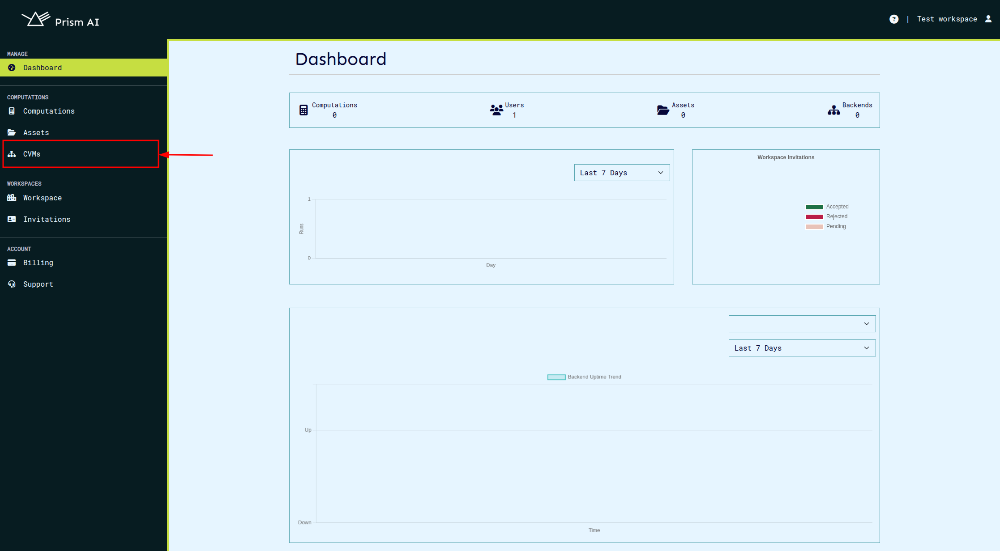
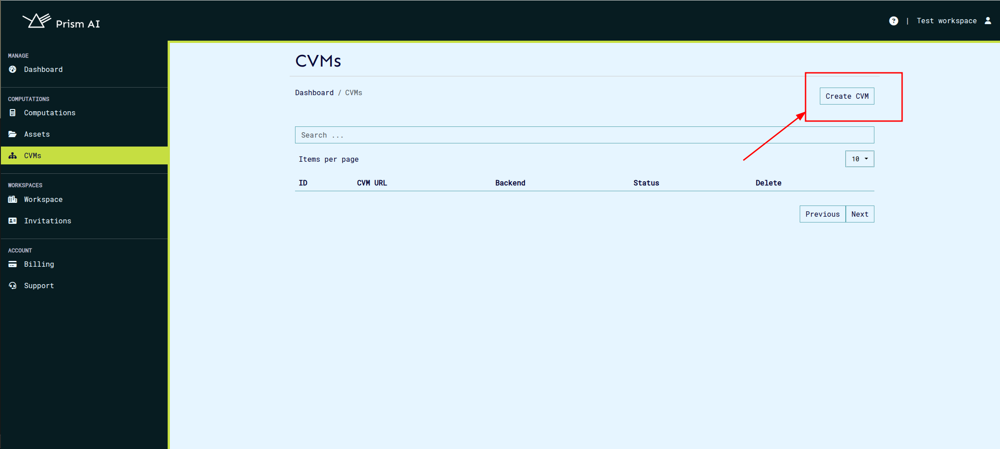
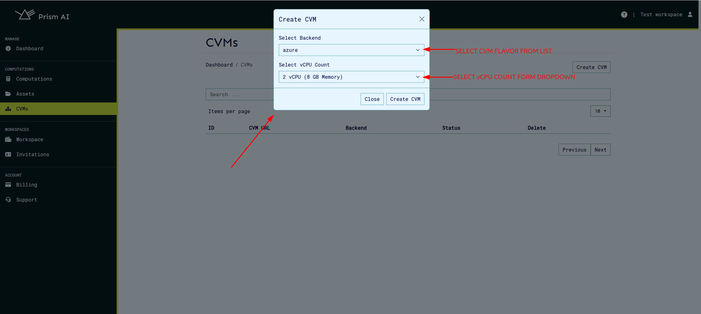
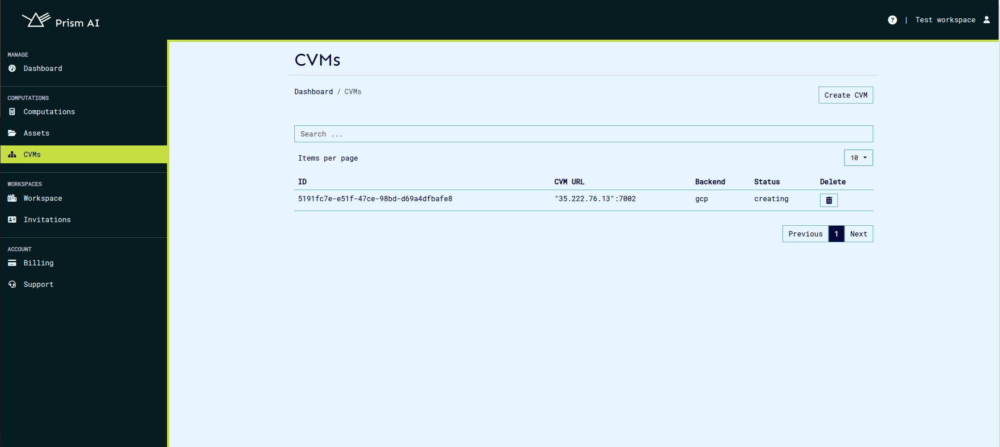
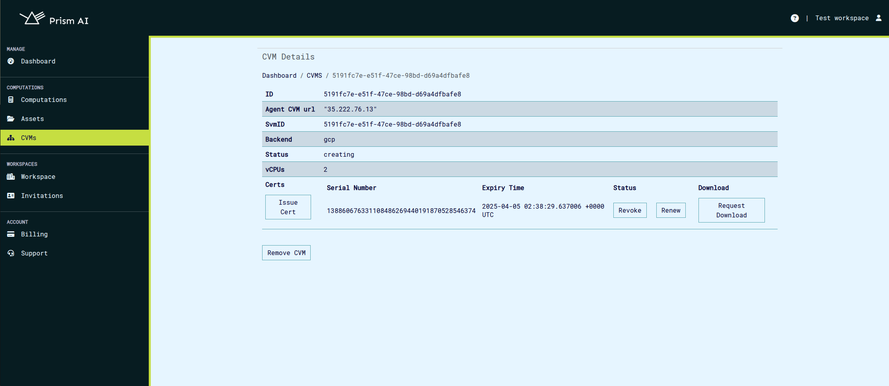
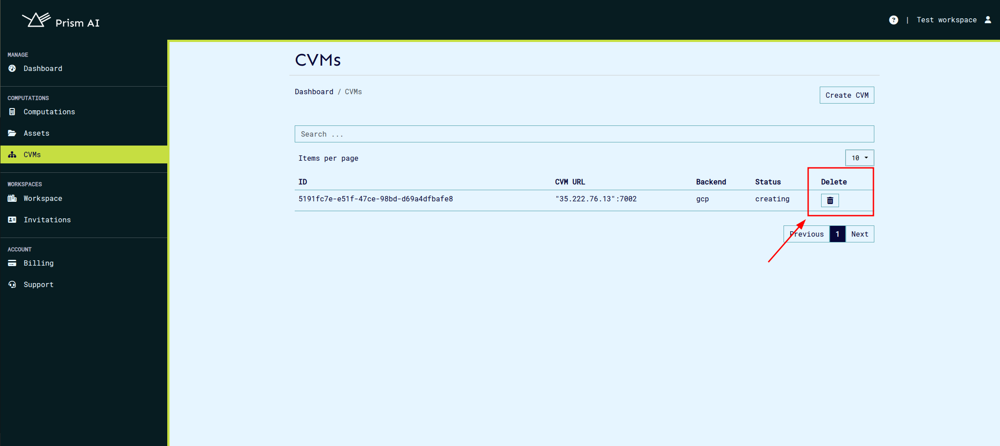

# Confidential Virtual Machines (CVMs)

## Overview

Confidential Virtual Machines (CVMs) provide a secure environment for running computations while ensuring data confidentiality. CVMs are available in multiple configurations, allowing users to select a flavor that best suits their needs. The currently supported flavors include:

- **GCP**: Confidential Virtual Machines hosted on Google Cloud Platform.
- **Azure**: Confidential Virtual Machines deployed on Microsoft Azure.
- **Manager**: Confidential Virtual Machines running on our dedicated cloud infrastructure.

Before computations can be executed, a CVM must be created and properly configured. Once set up, it can be selected for running workloads securely.

## **Confidential Computing Virtual Machines (CVM) Configurations**  

- **GCP CVMs** run on the **N2D machine series**, powered by **AMD EPYC Milan processors** with **up to 224 vCPUs and 896 GB RAM**. These instances leverage **SEV-SNP** for memory encryption, ensuring data remains confidential even from the hypervisor. They support **persistent and local SSD storage**, but **GPUs and nested virtualization are not available**. GCP CVMs offer **Secure Boot, vTPM, and integrity monitoring**, enhancing firmware security and trusted execution. They run **Ubuntu 22.04 LTS** and can be provisioned using **cloud-init** for automated configuration. The VMs require **on-host maintenance termination**, ensuring workloads remain secure during infrastructure updates.

- **Azure CVMs** utilize the **DCasv5 series**, featuring **AMD EPYC 7763v (Milan) processors** with **up to 96 vCPUs and 384 GB RAM**. These machines incorporate **SEV-SNP** for full memory encryption and hardware-isolated execution. They support **Premium SSD storage** but lack local disks, making them ideal for workloads requiring strict security without temporary storage dependencies. Azure CVMs also include **vTPM and Secure Boot**, enhancing firmware integrity and trusted execution. The VMs run **Canonical's Ubuntu Confidential VM (20.04 LTS)** and can be provisioned using **cloud-init** for automated configuration.  

- **Manager** spawns QEMU-based virtual machines configured for confidential computing and built using Buildroot. It runs on a Q35 machine type with an EPYC CPU, 8 vCPUs (scalable up to 64), and 16 GB RAM, supporting a maximum memory allocation of 30 GB. The VM leverages SEV-SNP for memory encryption and uses OVMF firmware for UEFI boot. It features a 10 GB disk image, virtualized networking with Virtio-Net PCI, and vsock support (Guest CID: 3) for secure communication. The system is based on Ubuntu 24.04.1 LTS with Docker, Python, and security-focused configurations. It operates headlessly with no graphical interface, emphasizing performance, security, and scalability in confidential computing environments. 

All configurations ensure robust **confidential computing capabilities**, with varying performance tiers to optimize security, cost, and workload efficiency.

---

## Creating a CVM

To create a CVM, follow these steps:

1. **Navigate to the CVMs Section:**

   - From the dashboard, click on the **CVMs** tab to access the CVM management page.

   

2. **Initiate CVM Creation:**

   - Click the **Create CVM** button to begin the setup process.

   

3. **Select Configuration Options:**

   - From the dropdown menu, choose the desired CVM flavor (GCP, Azure, or Manager).
   - Specify the amount of RAM (required for Azure and GCP CVMs).
   - Define the vCPU count (configurable for Azure and GCP CVMs only).

   

4. **CVM Provisioning:**

   - After submitting the configuration, the CVM creation process will begin. This may take a few minutes.
   - Once created, the CVM will appear in the list with its unique **ID, URL, and status**.

   

---

## Viewing CVM Details & Managing Certificates

Each CVM is initialized with default certificates that are used to verify secure communication between the CVM agent and Prism. To view or manage a CVM’s certificates:

1. **Access the CVM Details Page:**

   - Navigate to the CVM list.
   - Click on the **CVM ID** to open its details page.

   

2. **Manage Certificates:**

   - **Download Certificates:** Retrieve the default certificates for verification and secure connections.
   - **Revoke Certificates:** Invalidate compromised or outdated certificates.
   - **Renew Certificates:** Extend the validity of existing certificates.
   - **Issue New Certificates:** Generate additional certificates as needed.

   > **Note:** Default certificates are automatically loaded into the CVM during creation. Any newly issued certificates must be manually transferred to the CVM for use.

---

## Removing a CVM

If a CVM is no longer needed, it can be removed using the following steps:

1. **Navigate to the CVM List:**

   - Open the CVMs page.

2. **Initiate Removal:**

   - Click the **Delete** button next to the CVM you want to remove.

   

3. **CVM Deactivation:**
   - The CVM’s status will change to **Inactive** upon removal.

---

## Additional Notes

- CVMs provide an extra layer of security by ensuring that computations occur in a protected execution environment.
- Once a CVM is removed, its resources are deallocated, and it cannot be recovered.
- For Azure and GCP CVMs, compute resources should be selected carefully based on workload requirements to optimize cost and performance.
- Regularly update certificates to maintain secure connections.

By following these guidelines, users can efficiently manage their Confidential Virtual Machines while maintaining a high level of security and performance.
