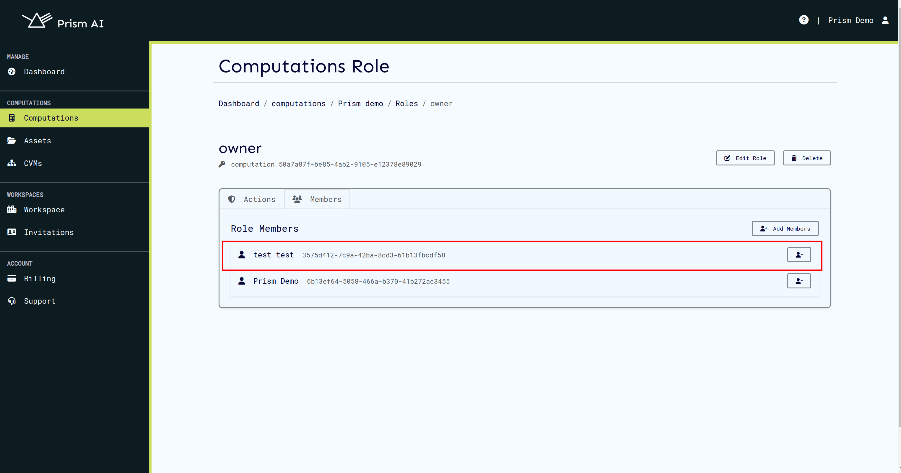

# Getting Started

The Prism UI gives is the easiest way to use the CoCoS system, giving the ability to use the entire prism system without interacting with the command line.
It provides a convenient way to log in to the CoCoS system, creation of users, workspaces, computations, computation policies, computation invitations, certs, backends, workspace billing and updating of all this information.
The UI can be found at [https://prism.ultraviolet.rs](https://prism.ultraviolet.rs). The UI is a web application and can be accessed from any modern web browser.

## Login User

In order to login user we need to provide username and password:

1. Navigate to the login page:

   

2. Enter your email and password, and click login.

   This will direct you to the workspaces page at which point you can select the workspace to log in to and proceed with using Prism.

   

A user can also register/create an account using the UI by clicking the Register button which prompts the user for a username, email, and password. After which, the user is free to create workspaces and manage their created system.

### Create a workspace

The workspaces page gives the user the ability to either create an entirely new workspace or join an existing workspace. The user can also view the workspace they are a part of and the workspace they have created.

On the ui the steps are as follows:

### Workspace Login

To log in to a Workspace click enter to log in to workspace with will bring you to the dashboard.

## CVMs

### Creating a CVM

CVMs are used to run computations. We need to create one before we are able to run a computation. Backend providers are available based on current subscription.

Please wait as the cvm is being created.

The cvm will come online in a few minutes.

## Computations

Once the cvm comes online, we can proceed to creating a computation. For computation management, we use Computations microservice.

### Create Computation

In order to create computation, we can to provide the following content:

Running a computation requires the following items:

| Item            | User     | User Role          | Computation Asset | Public Key | Additional Information                                                                                               |
| :-------------- | :------- | :----------------- | :---------------- | :--------- | :------------------------------------------------------------------------------------------------------------------- |
| Algorithm       | Required | Algorithm Provider | Algorithm         | Required   | Algorithms are required because they will be executed in TEE.                                                        |
| Dataset         | Optional | Dataset Provider   | Dataset           | Required   | Datasets are optional because some algorithms do not require training datasets.                                      |
| Result Consumer | Required | Result Consumer    | -                 | Required   | Result consumers are required because they are the users that can retrieve results after successful computation run. |

Public keys are mandatory because they are needed for user identification when uploading algorithm and datasets and when retrieving results. Therefore, users need to generate public/private key pairs and upload their public keys.

Users invited to a workspace:

1. need to be assigned user roles in the computation by the computation owner or admin.
2. need to create computation assets respective to their roles i.e. an algorithm provider needs to create an algorithm asset.
3. need to link all the required assets to the computation.
4. need to their private key for uploading assets and retrieving results.

These steps have been explained in the sections below.

### Assigning Computation Roles and Permissions

1. Navigate to the roles page from the computation details page.
   

2. Select a role to which you would like to add a user.
   Please note that this user needs to be invited to a workspace and to have accepted the invitation.
   

3. Switch to the members tab and click on the Add Members button.
   

4. Search for the user you'd like to assign a role.

5. Select the user from the list and click on Add Selected Members button.
   

6. Upon successful role assignment, the user will appear on the role details page.
   

### Linking Computation Assets

The assigned users from the previous step need to create and link their respective assets to the computation that they are assigned.
This can be done as follows:

1. Navigate to assets page and create a new asset.
   

2. A successfully created asset will appear in the assets page.
   

3. Search for the computation by name and link the asset.
   

4. Repeat the steps for all the assets that are needed to run the computation.

### Run Computation

Next we'll run the computation:

Notice the run button is disabled until all the requirements are met:

Once the requirements are satisfied, run computation button is enabled.

Once you click run computation, you will be required to select a CVM on which to run the computation:

This will result in events and logs from agent and manager visible on the ui.

### Stop Computation Run

To stop a computation run at any point, click the **Stop** button on the event's card. The card contains the details and list of events related to the current computation run. Once the run is stopped, the button will be hidden.

The **Stop** button can also be found in the Logs tab, on each card.

