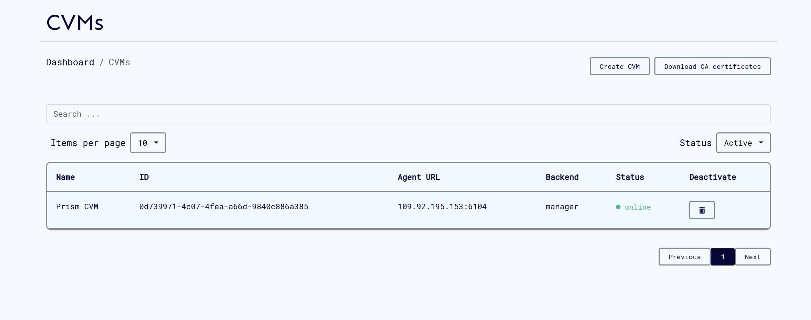
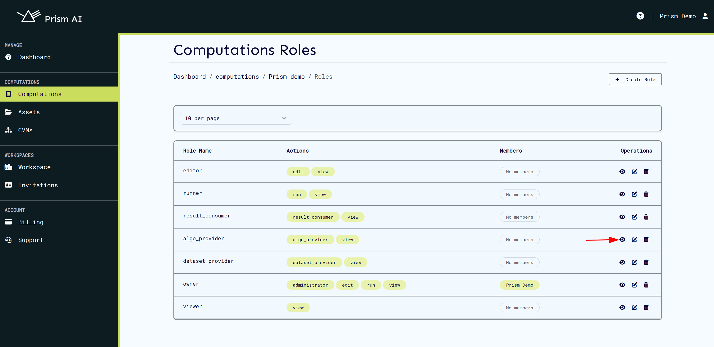
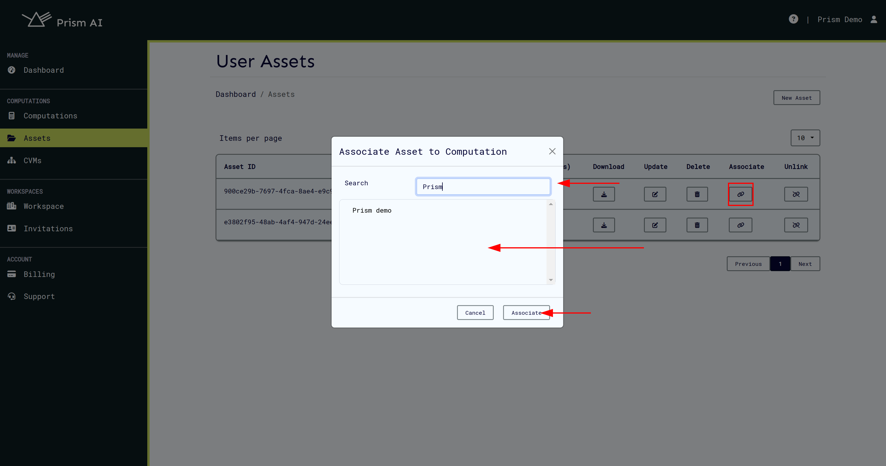

# Getting Started with Prism

Welcome to Prism! This guide will walk you through setting up your first workspace, creating secure compute environments, and running your first computation.

## What is Prism?

Prism is a confidential computing platform that enables secure multi-party computations using Trusted Execution Environments (TEEs). It allows multiple parties to collaborate on computations without exposing their sensitive data or algorithms.

## Quick Start Overview

1. **Account Setup** - Create your account and log in
2. **Workspace Creation** - Set up your collaborative environment  
3. **CVM Setup** - Create Confidential Virtual Machines for secure computing
4. **Computation Management** - Define, configure, and run secure computations.


---

## 1. Account Setup

### Creating Your Account

1. Navigate to the Prism UI at [https://prism.ultraviolet.rs](https://prism.ultraviolet.rs)
2. Click **Register** to create a new account
3. Provide your username, email, and secure password
4. Complete registration and verify your email if required


### Logging In

1. Go to the login page
2. Enter your email and password
3. Click **Login**


After successful login, you'll be directed to the workspaces page where you can select or create workspaces.

---

## 2. Workspace Management

### Understanding Workspaces

Workspaces are collaborative environments where teams can:

- Share secure computations
- Manage user permissions and roles
- Control access to algorithms and datasets
- Monitor computation runs and results

### Creating a New Workspace

1. From the workspaces page, click **Create New Workspace**
2. Provide a descriptive workspace name
3. Configure initial settings and permissions
4. Click **Create Workspace**


### Joining an Existing Workspace

If you've been invited to a workspace:

1. Check your email for workspace invitation or login to prism
2. Follow the invitation link
3. Accept the invitation
4. The workspace will appear in your workspace list

### Accessing Your Workspace

1. Select the desired workspace from your list
2. Click **Enter Workspace** to access the dashboard
3. You'll now have access to all workspace features


---

## 3. Set Up Your Keys

Keys enable secure, encrypted collaboration in Prism. They ensure only you can upload your assets and only you can decrypt your results—even Prism can't access your private data.

### Why Two Keys?

Prism uses **asymmetric cryptography** with a public/private key pair:

- **Public key** (shareable): Others use this to encrypt data *for you* and verify *you* signed something
- **Private key** (secret): Only you use this to decrypt data *meant for you* and sign data *from you*

### Generate Your Key Pair

Use our [CLI tool](https://docs.cocos.ultraviolet.rs/cli#command-keys):

```bash
./build/cocos-cli keys -k rsa
```

This will generate a key pair of type rsa.


**Supported types:** `rsa`, `ecdsa`, `ed25519`

This creates:

- `public_key.pem` → Upload to Prism when creating assets
- `private_key.pem` → Keep secret on your machine

> **Note:** You'll upload your public key when creating computation assets (next steps), not to your profile. Generate your keys now so they're ready.

**Secure Your Private Key as you'll need it to:**

- Upload algorithms/datasets (proves you authorized the upload)
- Download results (decrypts output meant for you)

> **Prism never sees your private key.** All signing and decryption happens locally on your machine—this is zero-trust security.

## 4. CVM (Confidential Virtual Machine) Setup

### What are CVMs?

CVMs are secure, isolated computing environments that run inside Trusted Execution Environments (TEEs). They ensure your computations remain confidential even from the cloud provider.

### Creating Your First CVM

> **Prerequisites**: You must have an active subscription with available backend providers (Azure, GCP, Ultraviolet, External).

1. Navigate to **CVMs** section in your workspace
2. Click **Create New CVM**
3. Select your preferred backend provider
4. Configure CVM specifications:
   - Memory allocation
   - CPU requirements
   - TEE type (AMD SEV_SNP/Intel TDX)
5. Click **Create CVM**


### CVM Status Monitoring

After creation, your CVM will go through several states:

- **Creating**: Initial setup in progress
- **Starting**: CVM is booting up
- **Online**: Ready for computations
- **Offline**: Not available for use




> **⏱️ Setup Time**: CVMs typically come online within 2-5 minutes after creation or longer ~10 minutes for public cloud CVMs Azure/GCP.

---

## 5. Computation Management

A computation is a secure collaborative task in Prism. It brings together an algorithm and data from different parties, runs them in an encrypted environment, and delivers results—all without any party seeing the other's sensitive information.

### The Problem It Solves

**Problem**: One party has valuable data they can't share (due to privacy, regulations, or competitive reasons), and another party has an algorithm they want to keep proprietary. Normally, collaboration is difficult.
**Prism's solution**: The algorithm runs on the data inside an encrypted environment. The data owner never sees the algorithm, the algorithm owner never sees the data, and the platform can't access either. Only the designated party receives the encrypted results.
This enables secure collaboration that would otherwise be legally or commercially impossible.

Every computation involves these roles:

- **Algorithm Provider** – Supplies the code or model to be executed (e.g., a data scientist with a predictive model)
- **Dataset Provider** – Supplies the input data for processing (e.g., a company with proprietary customer data)
- **Result Consumer** – Receives the encrypted computation output (e.g., the company receiving predictions)

Note: The same person or organization can hold multiple roles, or each role can be filled by different parties—the structure adapts to your collaboration needs.

### What You'll Set Up

To create a computation:

1. **Define the computation** – Name it and describe what it does
2. **Assign roles** – Choose which workspace members fill each role
3. **Link assets** – Connect the specific algorithm and dataset to use
4. **Select a CVM** – Pick where the secure computation will run
5. **Execute** – Run the computation and monitor progress

Let's walk through these steps.

### Creating a Computation

1. Navigate to **Computations** in your workspace
2. Click **New Computation**
3. Fill in computation details:
   - **Name**: Descriptive computation name
   - **Description**: Purpose and expected outcomes
   - **Agent Configuration**: In enclave agent TLS configurations


### Understanding Roles

Every computation has three required roles that represent different parties in the secure collaboration:

| Role | What They Provide | Required? |
|------|-------------------|-----------|
| **Algorithm Provider** | The code to run | ✅ Yes |
| **Dataset Provider** | Input data | ⚪ Optional |
| **Result Consumer** | Gets the results | ✅ Yes |

> **Example**: Company A provides a fraud-detection algorithm, Company B provides transaction data, Company C receives the fraud report.

Important constraints:

- One role per user: Each user can only be assigned to one role per computation
- Need multiple permissions? You can create custom roles or update existing ones to combine actions (e.g., a role that's both Algorithm Provider and Result Consumer)
- Other built-in roles exist: Owner, Viewer, Editor, Runner—for different access levels beyond the core computation roles

Each role has specific actions that determine what users can do—like `view`, `edit`, `run`, `algo_provider`, `dataset_provider`, or `result_consumer`. [Learn more about managing roles and permissions](./roles.md).

#### Step 1: Navigate to Roles

1. Go to your computation's details page
2. Click on **Roles** tab


#### Step 2: Assign User Roles

1. Select the role you want to populate (Algorithm Provider, Dataset Provider, or Result Consumer)
2. Click **Add Members**
3. Search for workspace users
4. Select users and confirm assignment




> **📝 Note**: Users must already be invited to the workspace before they can be assigned computation roles. A user cannot belong to more than one role, to add permissions you should actions on the required [role](./roles.md).

### Managing Computation Assets

#### Creating Assets

Each role owner needs to create their asset (algorithm, dataset, etc.) and link it to the computation. Assets are cryptographically verified using file hashes and secured using your public/private key pair.

Note: While you can create and link assets through the Prism web interface, certain operations like uploading files and retrieving results require the [Cocos CLI tool](https://github.com/ultravioletrs/cocos/blob/main/cli/README.md). Make sure you have it installed before proceeding.

1. Navigate to **Assets** → **Create New Asset**
2. Choose your asset type (Algorithm or Dataset)
3. Generate the file hash of your algorithm or dataset file using the [Cocos CLI](https://docs.cocos.ultraviolet.rs/cli#command-checksum):

   ```bash
   ./build/cocos-cli checksum <your_file>
   ```

   > The `checksum` command creates a hash—a unique digital fingerprint of your file. This ensures the exact same file is used in the computation and hasn't been modified.

4. Fill in the asset details, including:
   - Asset name and description
   - File hash from step 3

6. Click **Create Asset**


#### Upload Your Files to the CVM

After creating the asset metadata in Prism, upload the actual files to the Confidential Virtual Machine (CVM) using the [Cocos CLI](https://docs.cocos.ultraviolet.rs/cli#command-data) with your **private key**:

```bash
# For algorithms
./build/cocos-cli algo <algo_file> <private_key_file_path>

# For datasets
./build/cocos-cli data <dataset_path> <private_key_file_path>
```

> The CLI encrypts your files before uploading them to the CVM, where they remain protected throughout the computation. Your private key ensures only you can perform this upload.


#### Upload Your Files to the CVM

After creating the asset metadata in Prism, upload the actual files to the Confidential Virtual Machine (CVM) using the [Cocos CLI tool](https://github.com/ultravioletrs/cocos/blob/main/cli/README.md) with your **private key**.

First, export the agent's gRPC URL to connect to the CVM:

```bash
export AGENT_GRPC_URL=<agent_ip>:<port>
# Example: export AGENT_GRPC_URL=199.92.195.153:61088
```

You can find the AGENT_GRPC_URL on the computations page as shown:


Then upload your files:

```bash
# For algorithms
./build/cocos-cli algo -p <algo_file> <private_key_file_path> -r <requirements_file>

# For datasets
./build/cocos-cli data <dataset_path> <private_key_file_path>
```

The CLI connects to the agent via gRPC and encrypts your files before uploading them to the CVM, where they remain protected throughout the computation. Your private key ensures only you can perform this upload and later decrypt the results.

More documentation on: [algo](https://docs.cocos.ultraviolet.rs/cli/#command-algo) and [data](https://docs.cocos.ultraviolet.rs/cli/#command-data)

**Example output:**


#### Linking Assets to Computations

1. From your assets page, find the relevant asset


2. Click **Associate**
3. Search and select the target computation
4. Confirm the association



### Running Computations

#### Prerequisites Check

Before running, ensure:

- ✅ All required roles are assigned
- ✅ All necessary assets are linked
- ✅ At least one CVM is online
- ✅ Users have uploaded their public keys

The **Run Computation** button will be disabled until all requirements are met.


#### Executing the Computation

1. Click **Run Computation** (when enabled)
2. Select an available online CVM
3. Confirm execution


### Monitoring Execution

#### Real-time Monitoring

Once started, you can monitor:

- **Events**: High-level computation milestones
- **Logs**: Detailed execution information from the inenclave agent


#### Stopping a Running Computation

You can stop a computation at any time by:

1. Clicking the **Stop** button on the events card, or
2. Using the **Stop** button in the Logs tab


#### Retrieve Your Computation Results

First, export the agent's gRPC URL to connect to the CVM:

```bash
export AGENT_GRPC_URL=<agent_ip>:<port>
# Example: export AGENT_GRPC_URL=199.92.195.153:61088
```

You can find the AGENT_GRPC_URL on the computations page as shown:


Once the computation completes, download and decrypt your results using the [Cocos CLI tool](https://docs.cocos.ultraviolet.rs/cli/#command-result) with your **private key**:

```bash
./build/cocos-cli result <private_key_file_path> <output_file_name>
```

> The CLI connects to the agent, retrieves the encrypted computation result, and decrypts it using your private key. Only you can decrypt results meant for your role.

**Example output:**


The decrypted results will be saved to your specified output file, ready for analysis.

---

## Troubleshooting

### Common Issues

#### CVM Won't Start

- Check your subscription status and available credits
- Try creating a new CVM
- Contact support if the issue persists

#### Can't Run Computation

- Ensure all required assets are linked
- Verify all roles have assigned users
- Check that at least one CVM is online
- Check your subscription status and available credits

#### Asset Upload Failures

- Verify your public key is correctly uploaded
- Ensure you have proper role permissions

### Getting Help

- **Documentation**: Browse our comprehensive docs
- **Support**: Contact our support team
- **Community**: Join our user community forums

---

## Next Steps

Now that you've completed the getting started guide:

1. **Explore Advanced Features**: Learn about [computation roles](./roles.md), advanced security settings
2. **API Integration**: Discover how to automate workflows using our [API](./api.md)
3. **Attestation**: Discover our [attestation](https://docs.cocos.ultraviolet.rs/attestation-introduction) implementation
4. **Community**: Connect with other Prism and [CoCoS](https://docs.cocos.ultraviolet.rs/) users

Ready to dive deeper? Check out our [Computation documentation](../computations) and [API Documentation](../api/).

---
