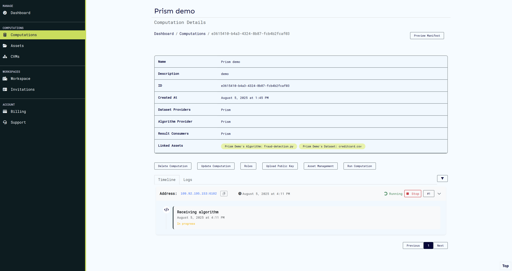
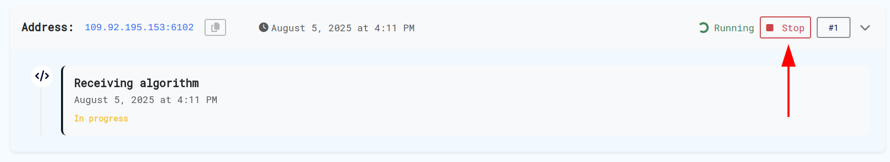

# Getting Started with Prism

Welcome to Prism! This guide will walk you through setting up your first workspace, creating secure compute environments, and running your first computation.

## What is Prism?

Prism is a confidential computing platform that enables secure multi-party computations using Trusted Execution Environments (TEEs). It allows multiple parties to collaborate on computations without exposing their sensitive data or algorithms.

## Quick Start Overview

1. **Account Setup** - Create your account and log in
2. **Workspace Creation** - Set up your collaborative environment  
3. **CVM Setup** - Create Confidential Virtual Machines for secure computing
4. **Computation Management** - Define, configure, and run secure computations

---

## Account Setup

### Creating Your Account

1. Navigate to the Prism UI at [https://prism.ultraviolet.rs](https://prism.ultraviolet.rs)
2. Click **Register** to create a new account
3. Provide your username, email, and secure password
4. Complete registration and verify your email if required


### Logging In

1. Go to the login page
2. Enter your email and password
3. Click **Login**


After successful login, you'll be directed to the workspaces page where you can select or create workspaces.

---

## Workspace Management

### Understanding Workspaces

Workspaces are collaborative environments where teams can:

- Share secure computations
- Manage user permissions and roles
- Control access to algorithms and datasets
- Monitor computation runs and results

### Creating a New Workspace

1. From the workspaces page, click **Create New Workspace**
2. Provide a descriptive workspace name
3. Configure initial settings and permissions
4. Click **Create Workspace**


### Joining an Existing Workspace

If you've been invited to a workspace:

1. Check your email for workspace invitation or login to prism
2. Follow the invitation link
3. Accept the invitation
4. The workspace will appear in your workspace list

### Accessing Your Workspace

1. Select the desired workspace from your list
2. Click **Enter Workspace** to access the dashboard
3. You'll now have access to all workspace features


---

## CVM (Confidential Virtual Machine) Setup

### What are CVMs?

CVMs are secure, isolated computing environments that run inside Trusted Execution Environments (TEEs). They ensure your computations remain confidential even from the cloud provider.

### Creating Your First CVM

> **Prerequisites**: You must have an active subscription with available backend providers (Azure, GCP, Ultraviolet, External).

1. Navigate to **CVMs** section in your workspace
2. Click **Create New CVM**
3. Select your preferred backend provider
4. Configure CVM specifications:
   - Memory allocation
   - CPU requirements
   - TEE type (AMD SEV_SNP/Intel TDX)
5. Click **Create CVM**


### CVM Status Monitoring

After creation, your CVM will go through several states:

- **Creating**: Initial setup in progress
- **Starting**: CVM is booting up
- **Online**: Ready for computations
- **Offline**: Not available for use


> **⏱️ Setup Time**: CVMs typically come online within 2-5 minutes after creation or longer ~10 minutes for public cloud CVMs Azure/GCP.

---

## Computation Management

### Understanding Computations

A computation in Prism CoCoS involves multiple parties collaborating securely:

| Component | Role | Required | Description |
|-----------|------|----------|-------------|
| **Algorithm** | Algorithm Provider | ✅ Required | The secure code to be executed |
| **Dataset** | Dataset Provider | ⚪ Optional | Training or input data (if needed) |
| **Result Consumer** | Result Consumer | ✅ Required | Party authorized to retrieve results |

### Creating a Computation

1. Navigate to **Computations** in your workspace
2. Click **New Computation**
3. Fill in computation details:
   - **Name**: Descriptive computation name
   - **Description**: Purpose and expected outcomes
   - **Agent Configuration**: In enclave agent TLS configurations


### Setting Up User Roles

#### Step 1: Navigate to Roles

1. Go to your computation's details page
2. Click on **Roles** tab


#### Step 2: Assign User Roles

1. Select the role you want to populate (Algorithm Provider, Dataset Provider, or Result Consumer)
2. Click **Add Members**
3. Search for workspace users
4. Select users and confirm assignment


> **📝 Note**: Users must already be invited to the workspace before they can be assigned computation roles. A user cannot belong to more than one role, to add permissions you should actions on the required [role](./roles.md).

### Managing Computation Assets

#### Creating Assets

Users assigned to roles must create their respective assets:

1. Navigate to **Assets** section and click **Create New Asset**
2. Choose asset type (Algorithm, Dataset, etc.)
3. Generate a public/private key pair using your preferred tool or using [Cocos CLI](https://docs.cocos.ultraviolet.rs/cli#command-keys):

```code
./build/cocos-cli keys -k rsa
```

This will generate a key pair of type rsa. Different key types can be generated using the -k flag. Currently supported types on cocos are rsa, ecdsa and ed25519. For example:


4. Upload your public key to your Prism profile. Keep your private key secure - you'll need it for:
   - Uploading [algorithms](https://docs.cocos.ultraviolet.rs/cli#command-algo) and [datasets](https://docs.cocos.ultraviolet.rs/cli#command-data)

```code
./build/cocos-cli algo <algo_file> <private_key_file_path>

./build/cocos-cli data <dataset_path> <private_key_file_path>
```

   - [Retrieving computation results](https://docs.cocos.ultraviolet.rs/cli#command-result)

```code
./build/cocos-cli result <private_key_file_path> <optional_file_name.zip>
```

_Note:_ You need to generate file hash for assets before uploading them. For this, use [cocos-cli](https://docs.cocos.ultraviolet.rs/cli/#command-checksum),our command-line tool to help compute the sha3-256 hash of a file.

```code
./build/cocos-cli checksum <file>
```


#### Linking Assets to Computations

1. From your assets page, find the relevant asset
2. Click **Link to Computation**
3. Search and select the target computation
4. Confirm the association


### Running Computations

#### Prerequisites Check

Before running, ensure:

- ✅ All required roles are assigned
- ✅ All necessary assets are linked
- ✅ At least one CVM is online
- ✅ Users have uploaded their public keys

_Note:_ You can generate keys for running a computation using [cocos-cli _key_ command](https://docs.cocos.ultraviolet.rs/cli#command-keys).

```code
./build/cocos-cli keys -k rsa
```

The **Run Computation** button will be disabled until all requirements are met.


#### Executing the Computation

1. Click **Run Computation** (when enabled)
2. Select an available online CVM
3. Confirm execution


### Monitoring Execution

#### Real-time Monitoring

Once started, you can monitor:

- **Events**: High-level computation milestones
- **Logs**: Detailed execution information from the inenclave agent



#### Stopping a Running Computation

You can stop a computation at any time by:

1. Clicking the **Stop** button on the events card, or
2. Using the **Stop** button in the Logs tab




---

## Security & Public Keys

### Why Public Keys Matter

Public keys are essential for:

- User identification and authentication
- Secure asset uploads
- Encrypted result retrieval
- Maintaining computation integrity

### Managing Your Keys

1. Generate a public/private key pair using your preferred tool or using [Cocos CLI](https://docs.cocos.ultraviolet.rs/cli#command-keys)
2. Upload your public key to your Prism profile
3. Keep your private key secure - you'll need it for:
   - [Uploading algorithms and datasets](https://docs.cocos.ultraviolet.rs/cli#command-algo)
   - [Retrieving computation results](https://docs.cocos.ultraviolet.rs/cli#command-data)

   ```code

   ./build/cocos-cli keys -k rsa

   ./build/cocos-cli algo <algo_path> <private_key_file_path>

   ./build/cocos-cli data <dataset_path> <private_key_file_path>
   ```

> **🔐 Security Best Practice**: Never share your private key. Prism only needs your public key for verification.

---

## Troubleshooting

### Common Issues

#### CVM Won't Start

- Check your subscription status and available credits
- Try creating a new CVM
- Contact support if the issue persists

#### Can't Run Computation

- Ensure all required assets are linked
- Verify all roles have assigned users
- Check that at least one CVM is online
- Check your subscription status and available credits

#### Asset Upload Failures

- Verify your public key is correctly uploaded
- Ensure you have proper role permissions

### Getting Help

- **Documentation**: Browse our comprehensive docs
- **Support**: Contact our support team
- **Community**: Join our user community forums

---

## Next Steps

Now that you've completed the getting started guide:

1. **Explore Advanced Features**: Learn about [computation roles](./roles.md), advanced security settings
2. **API Integration**: Discover how to automate workflows using our [API](./api.md)
3. **Attestation**: Discover our [attestation](https://docs.cocos.ultraviolet.rs/attestation-introduction) implementation
4. **Community**: Connect with other Prism and [CoCoS](https://docs.cocos.ultraviolet.rs/) users

Ready to dive deeper? Check out our [Computation documentation](../computations) and [API Documentation](../api/).

---
