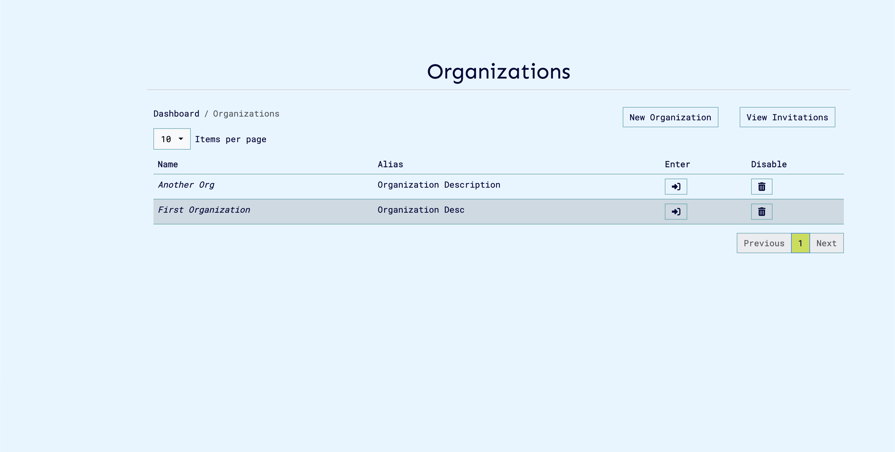
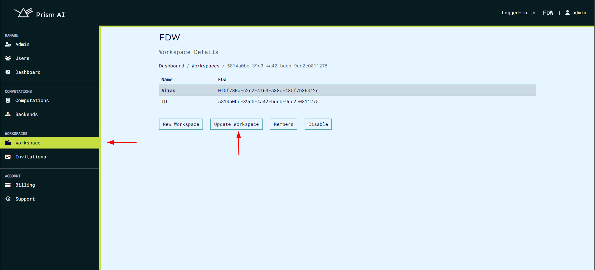
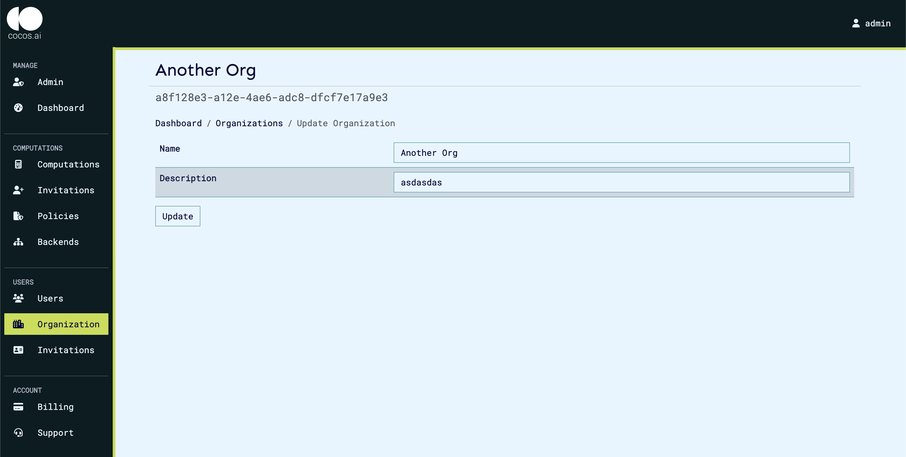
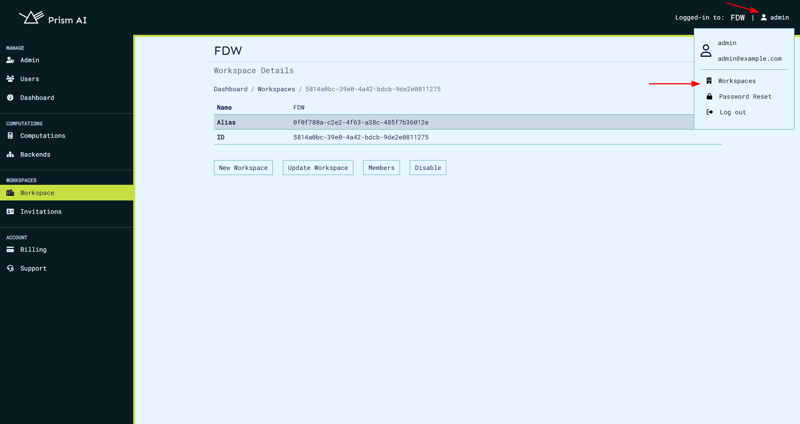
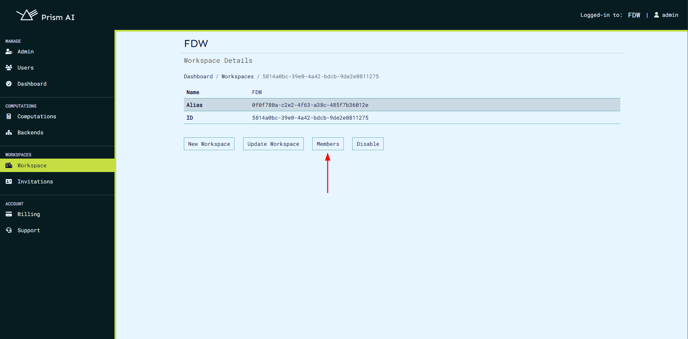
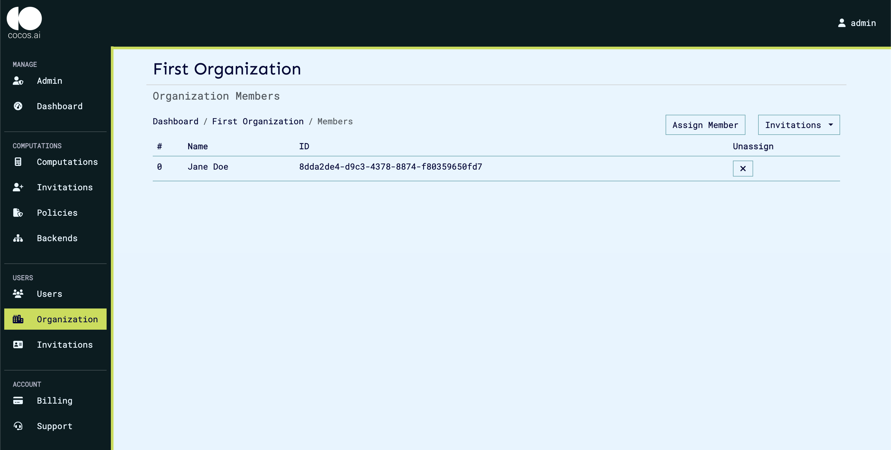

# Projects

Projects represent a consortium of users, computations, and resources that provides a single way to allow management of resources in the system. The projects / projects simplify access control by allowing only users who are in a particular project to access resources which they have been assigned to.

Within projects, different users have different roles that allow them to only perform certain operations within the project, such as creation of other users and other admin related tasks. A single user can belong to multiple projects, with which they can have different roles based on the policy assigned.

For any user to access the CoCoS system, they must be part of an project, and have to be signed in to the project.

## Create an project

```bash
curl -sSiX POST https://prism.ultraviolet.rs/auth/domains/ -H "Content-Type: application/json" -H "Authorization: Bearer <user_token>" -d @- << EOF
{
  "name": "project 1",
  "alias": "org1"
}
EOF
```

For example:

```bash
curl -sSiX POST https://prism.ultraviolet.rs/auth/domains/ -H "Content-Type: application/json" -H "Authorization: Bearer <user_token>" -d @- << EOF
{
  "name": "project 1",
  "alias": "org1"
}
EOF

HTTP/1.1 200 OK
Content-Type: application/json
Date: Tue, 30 Apr 2024 13:17:33 GMT
Content-Length: 235

{
  "id":"fda88db8-97e1-4560-8db1-29e8a40b5d0c",
  "name":"project 1",
  "alias":"org1",
  "status":"enabled",
  "created_by":"0dce22c6-1a94-4a8e-a701-185a4c37df58",
  "created_at":"2024-04-30T13:17:32.884558Z",
  "updated_at":"0001-01-01T00:00:00Z"
}
```

On the ui the steps are as follows:

1. Log in to prism platform with a user with administrator permission.
2. On successfully log in, projects page is displayed. Click on 'New Project'.
   
3. Fill the required fields and click 'Create Project'
   

## Update project

Update project

```bash
curl -sSiX PUT https://prism.ultraviolet.rs/auth/domains/<project_id> -H "Content-Type: application/json" -H "Authorization: Bearer <user_token>" -d @- << EOF
{
  "name": "project 1",
  "alias": "org1"
}
EOF
```

For example:

```bash
curl -sSiX PATCH https://prism.ultraviolet.rs/auth/domains/127910df-7eca-42dc-a625-1f8fda70229c -H "Content-Type: application/json" -H "Authorization: Bearer <user_token>" -d @- << EOF
{
  "name": "project 1",
  "alias": "org1"
}
EOF
HTTP/1.1 200 OK
Content-Type: application/json
Date: Fri, 24 May 2024 06:28:08 GMT
Content-Length: 294

{
  "id":"127910df-7eca-42dc-a625-1f8fda70229c",
  "name":"project 1",
  "alias":"org1",
  "status":"enabled",
  "created_by":"c7a1374c-b6e1-4cfd-b333-696bec0c672d",
  "created_at":"2024-05-24T05:29:47.030197Z",
  "updated_by":"c7a1374c-b6e1-4cfd-b333-696bec0c672d",
  "updated_at":"2024-05-24T06:28:08.121207Z"
}
```

On the ui the steps are as follows:

1. Click on 'Projects' on the navigation panel to view project details.
   

2. Click on 'Update Project' to navigate to the update project page.
3. Make necessary changes and click 'update'
   

## Get project

```bash
curl -isSX GET https://prism.ultraviolet.rs/auth/domains/<project_id> -H "Content-Type: application/json" -H "Authorization: Bearer <user_token>"
```

For example:

```bash
curl -sSiX GET https://prism.ultraviolet.rs/auth/domains/127910df-7eca-42dc-a625-1f8fda70229c -H "Content-Type: application/json" -H "Authorization: Bearer <user_token>"

HTTP/1.1 200 OK
Content-Type: application/json
Date: Fri, 24 May 2024 06:32:29 GMT
Content-Length: 294

{
  "id":"127910df-7eca-42dc-a625-1f8fda70229c",
  "name":"project 1",
  "alias":"org1",
  "status":"enabled",
  "created_by":"c7a1374c-b6e1-4cfd-b333-696bec0c672d",
  "created_at":"2024-05-24T05:29:47.030197Z",
  "updated_by":"c7a1374c-b6e1-4cfd-b333-696bec0c672d",
  "updated_at":"2024-05-24T06:28:08.121207Z"
}
```

On the ui the steps are as follows:

1. Click on 'Projects' on the navigation panel to view project details.
   

## Get projects

To paginate the results, use `offset`, `limit`, `metadata`, `name`, `status`, `parentID`, `ownerID`, `tree` and `dir` as query parameters.

```bash
curl -isSX GET https://prism.ultraviolet.rs/auth/domains/ -H "Content-Type: application/json" -H "Authorization: Bearer <user_token>"
```

For example:

```bash
curl -sSiX GET https://prism.ultraviolet.rs/auth/domains/ -H "Content-Type: application/json" -H "Authorization: Bearer <user_token>"

HTTP/1.1 200 OK
Content-Type: application/json
Date: Fri, 24 May 2024 06:32:59 GMT
Content-Length: 898

{
  "total":3,
  "offset":0,
  "limit":10,
  "domains": [
    {
      "id":"2c8f3651-eb61-4a2d-8473-a84ae7a94845",
      "name":"Test Org2",
      "alias":"Desc 2",
      "status":"enabled",
      "permission":"administrator",
      "created_by":"c7a1374c-b6e1-4cfd-b333-696bec0c672d",
      "created_at":"2024-05-24T05:37:43.870852Z",
      "updated_at":"0001-01-01T00:00:00Z"
    },
    {
      "id":"f5bc07b4-bdc1-426f-8d18-d625bb5da8ac",
      "name":"Another Org",
      "alias":"Desc 2",
      "status":"enabled",
      "permission":"administrator",
      "created_by":"c7a1374c-b6e1-4cfd-b333-696bec0c672d",
      "created_at":"2024-05-24T05:47:32.275316Z",
      "updated_at":"0001-01-01T00:00:00Z"
    },
    {"id":"127910df-7eca-42dc-a625-1f8fda70229c",
    "name":"project 1",
    "alias":"org1",
    "status":"enabled",
    "permission":"administrator",
    "created_by":"c7a1374c-b6e1-4cfd-b333-696bec0c672d",
    "created_at":"2024-05-24T05:29:47.030197Z",
    "updated_by":"c7a1374c-b6e1-4cfd-b333-696bec0c672d",
    "updated_at":"2024-05-24T06:28:08.121207Z"
    }
  ]
}
```

On the ui the steps are as follows:

1. Click on user profile at the top right, then click on "Projects" on the menu. This navigates to the projects page.
   
2. Project page is displayed.
   

## Assign

Assign user to an project

```bash
curl -sSiX POST https://prism.ultraviolet.rs/auth/domains/<project_id>/members -H "Content-Type: application/json" -H "Authorization: Bearer <user_token>" -d @- << EOF
{
  "subject": "<user_id>",
  "object": "<project_id>",
  "relation": ["<relations>"]
}
EOF
```

For example:

```bash
curl -sSiX POST https://prism.ultraviolet.rs/auth/domains/127910df-7eca-42dc-a625-1f8fda70229c/users/assign -H "Content-Type: application/json" -H "Authorization: Bearer <user_token>" -d @- << EOF
{
  "relation": "member",
  "user_ids": ["1470462e-70d3-4e3f-82d8-7df5ad643de3"]
}
EOF

HTTP/1.1 201 Created
Content-Type: application/json
Date: Fri, 24 May 2024 06:51:37 GMT
Content-Length: 0

```

On the ui the steps are as follows:

1. From Project details page, click on 'Members'. This navigates to Members page.
   

2. From Member page, click on 'Assign Member'. A modal dialog will appear that allowing member relation assignment.
   

## Members

To paginate the results, use `offset`, `limit`, `metadata`, `name`, `status`, `parentID`, `ownerID`, `tree` and `dir` as query parameters.

> Must take into consideration the user identified by the `user_token` needs to be assigned to the same project identified by `group_id` with `g_list` action or be the owner of the project identified by `group_id`.

```bash
curl -isSX GET https://prism.ultraviolet.rs/auth/domains/<project_id>/users -H "Content-Type: application/json" -H "Authorization: Bearer <user_token>"
```

For example:

```bash
 curl -sSiX GET https://prism.ultraviolet.rs/auth/domains/ec7f6b62-3b0b-4f6f-925f-c1f09ab2f883/users\?permission\=view -H "Content-Type: application/json" -H "Authorization: Bearer <user_token>"

HTTP/1.1 200 OK
Content-Type: application/json
Date: Sat, 25 May 2024 08:44:49 GMT
Content-Length: 216

{
  "limit":10,
  "offset":0,
  "total":1,
  "users": [
    {
      "id":"986a04e5-be5b-4041-b649-f64346720219",
      "name":"John Doe",
      "credentials":{},
      "created_at":"0001-01-01T00:00:00Z",
      "updated_at":"0001-01-01T00:00:00Z",
      "status":"enabled"
    }
  ]
}
```

On the ui steps are as follows:
On the ui, steps are as follows:

1. From Project details page, click on 'Members'. This navigates to Members page.
   
2. Project members page is displayed.
   
