# Roles

## Computation Roles

Computation roles are used to manage user actions to a computation. On service start, builtin roles are created with their associated actions which can be assigned to a user on a particular computation. These builtin roles can be updated, deleted, and new ones added.

The following builtin roles are created on service initialization:

| Built-in Role     | Actions                        |
| ----------------- | ------------------------------ |
| Owner             | view, edit, run, administrator |
| AlgorithmProvider | view, algo_provider            |
| DatasetProvider   | view, dataset_provider         |
| ResultConsumer    | view, result_consumer          |
| Viewer            | view                           |
| Editor            | view, edit                     |
| Runner            | view, run                      |

Here’s an enhanced version of your Role Management documentation with additional explanations and clarity:

## Role Management

### Overview

Role management allows users to define access control within a computation. Each role determines the level of permissions a user has, ensuring proper governance of computations and associated data.

### Accessing Role Management

To manage roles, you must first create a new computation. This can be done by clicking the **New Computation** button on the **Computations** page.

Once the computation is created, click on it to open its **Details** page. From there, navigate to the **Roles** section by clicking the **Roles** button as shown below:

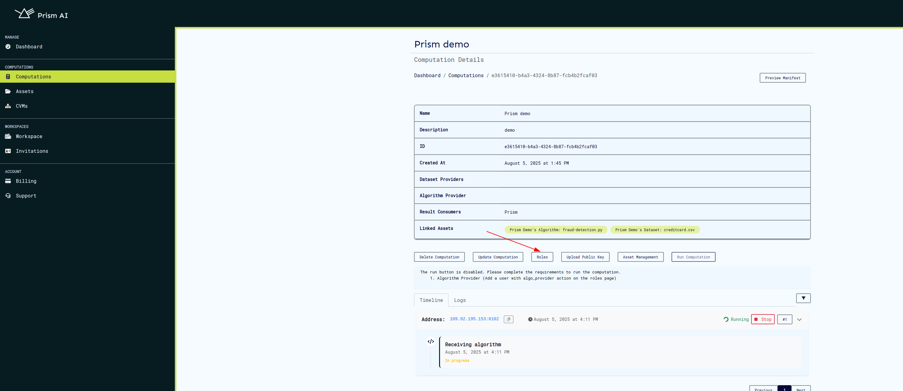

Clicking on the **Roles** button will display all predefined built-in roles, each with specific permissions.

## Managing Roles

### Creating a Role

In addition to built-in roles, custom roles can be created to fit specific access needs. To create a new role, click the **Create Role** button.

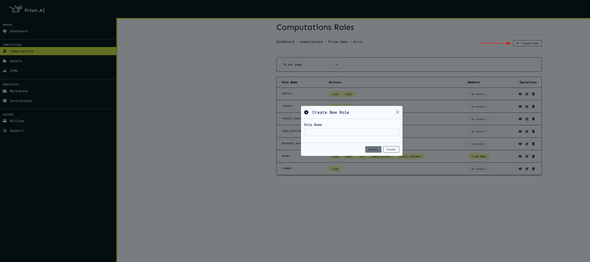

After clicking, a form will appear where you can define the role name and assign relevant permissions. Once saved, the role will be available for assignment to users.

### Updating a Role

Existing roles can be modified to adjust permissions or rename them. To update a role:

1. Click the **Update Role** button next to the role you want to edit.
2. Modify the role name or permissions in the pop-up form.
3. Save the changes to apply updates.

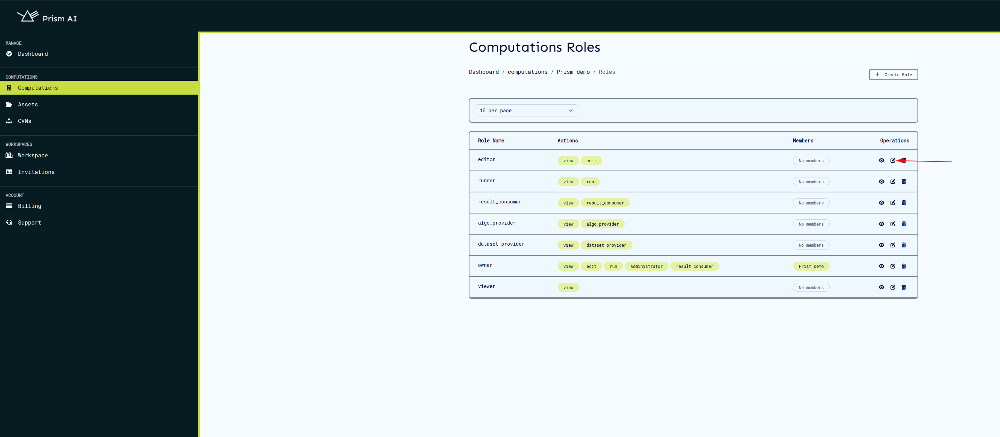  
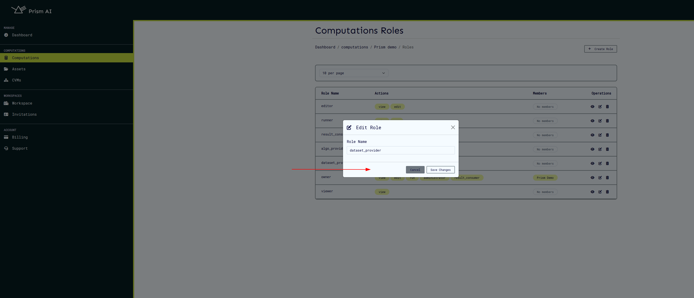

### Viewing Role Details

To see the details of a specific role, including assigned permissions and users, click the **View Role** button.

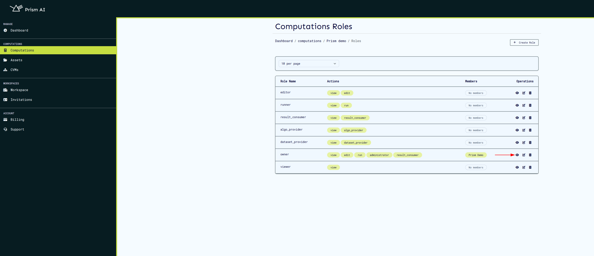

This will display:

- **Role Actions**: The list of actions permitted under this role.
- **Role Members**: Users currently assigned to this role.

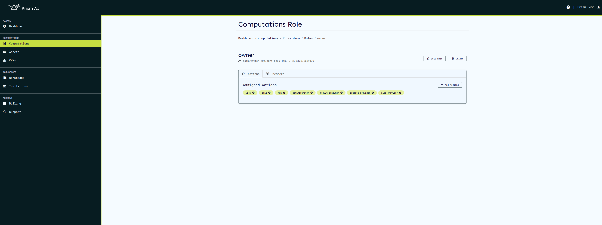  
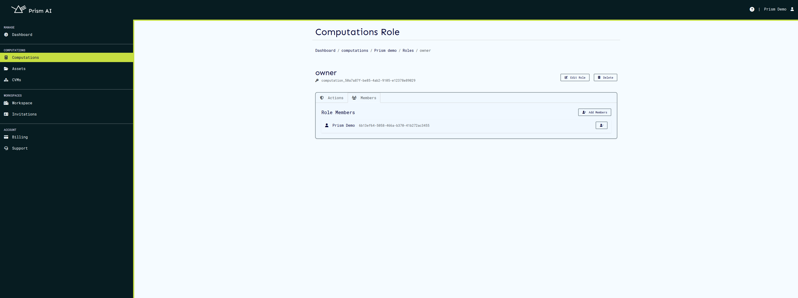

## Managing Users in Roles

### Adding a User to a Role

Users can be assigned to roles to grant them the associated permissions.

1. Click the **Add Members** button.
2. Select the users you want to assign to the role.
3. Confirm to save the changes.

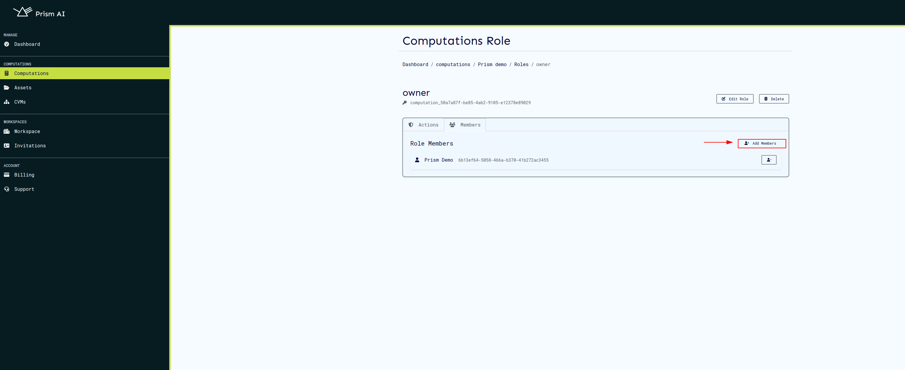  
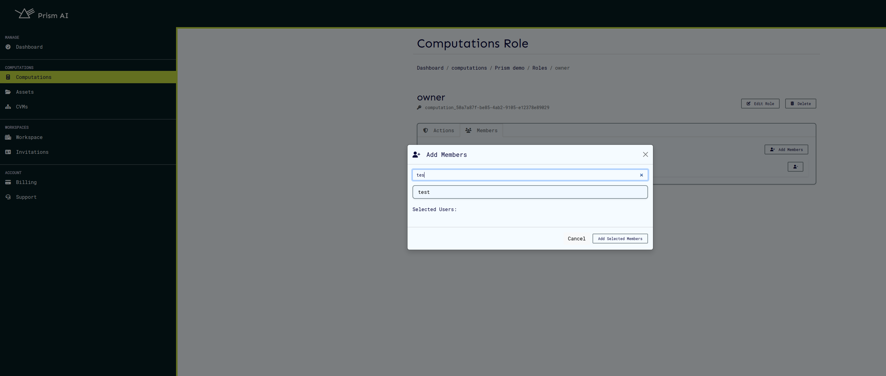

### Removing a User from a Role

To revoke a user's access under a specific role:

1. Navigate to the role's details page.
2. Locate the user in the **Role Members** section.
3. Click the **Remove** button next to the user’s name.

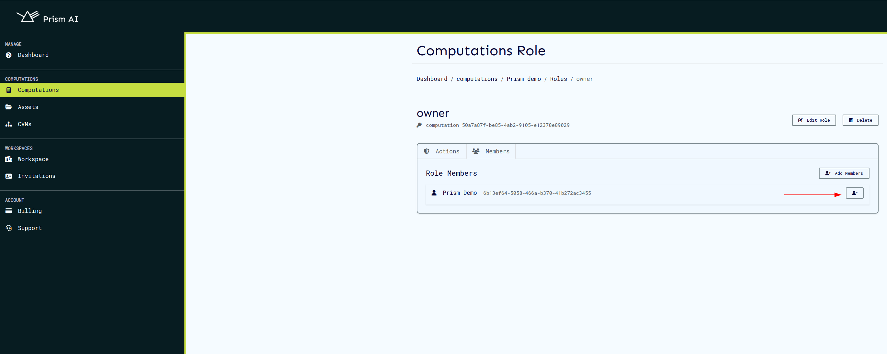

## Deleting a Role

Roles that are no longer needed can be removed. **Note:** Deleting a role will revoke access for all users assigned to it.

1. Click the **Delete Role** button next to the role you want to remove.
2. Confirm the deletion in the prompt.

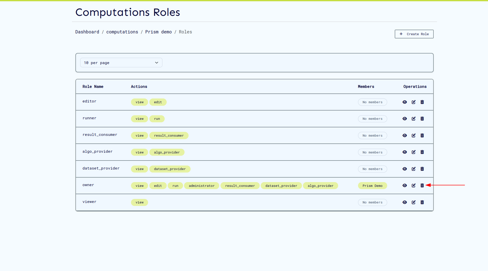
