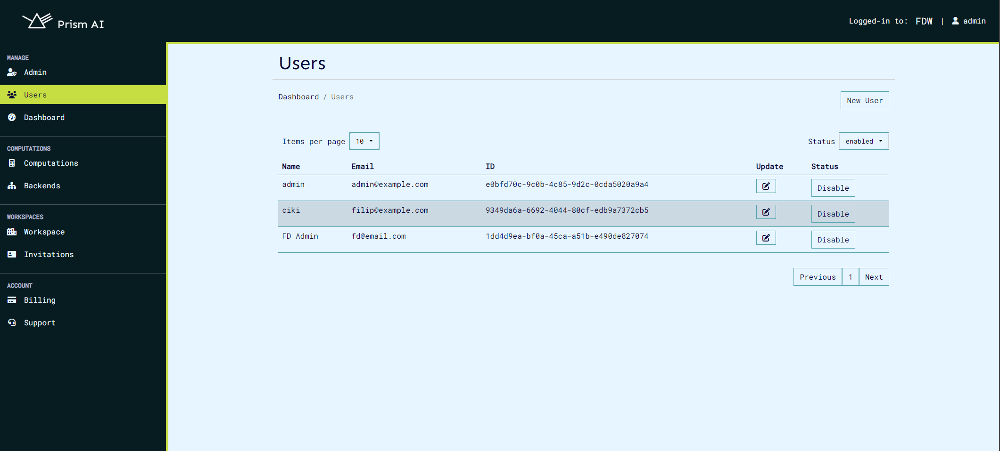
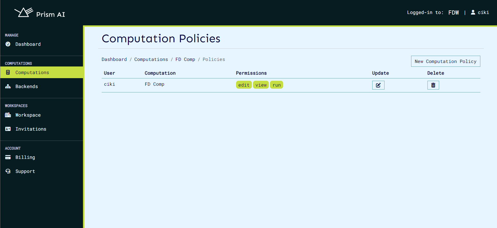

# UI

The Prism UI gives is the easiest way to use the CoCoS system, giving the ability to use the entire prism system without interacting with the command line. It provides a convenient way to log in to the CoCoS system, creation of users, organizations, computations, computation policies, computation invitations, organization billing and updating of all this information.

## Getting Started

The UI can be found at [https://prism.ultraviolet.rs](https://prism.ultraviolet.rs). The UI is a web application and can be accessed from any modern web browser. Currently, the source code is not available for the UI, but it is planned to be open sourced in the future.

## Login

A default user is created when the CoCoS system is installed. The default user is `admin`, with email `admin@example.com` and the password is `12345678`. This user can be used to log in to the UI. Once logged in, the user can change their password and create new users. The next layer of security is the organization, which is a collection of users. The user can create a new organization and invite other users to join the organization. Prior to accessing the CoCoS system, the user must be a part of an organization.

The organizations page gives the user the ability to either create an entirely new organization or join an existing organization. The user can also view the organizations they are a part of and the organizations they have created.

## Organizations

The organizations page gives the user the ability to create new organizations. The user can also view the organizations they are a part of and the organizations they have created. The user can also update the information of the organizations they have created. The organization page also includes a members tab, which shows the users that are a part of the organization. On this tab, the organization owner can also invite new users to join the organization and assign different roles to the different users that have been assigned to the organization.

## Users

The users page gives the user the ability to create new users. The user can also view the users they have created and the users that are a part of the organization they are in. The user can also update the information of the users they have created.

## Computations

The computations page gives the user the ability to create new computations. The user can also view the computations they have created and the computations that are a part of the organization they are in. The user can also update the information of the computations they have created. On the computations page, the computation admin has the ability to invite other users into the computation. Once a user is invited to the computation, they are required to provide their public certificate for them to be able to run the computation.

On the computations page, the user has the ability to view invitations that have been sent to them and either accept or reject the invitation. The computation admin also has the ability to view the users that are a part of the computation and the roles that have been assigned to the different users.

## Computation Policies

The computation policies page gives the user the ability to create new computation policies. The user can also view the computation policies they have created and the computation policies that are a part of the organization they are in. The user can also update the information of the computation policies they have created. A computation policy is used to determine the roles that are assigned to the different users that are a part of the computation, such as editor, viewer, or admin.

## Billing

Billing service allows the organization and users to pay for the services they use. The first step in billing is to create a billing customer, which you create as the first step when you access the organization settings page.

Once the customer is created, the user can select one of the plans created by the admin and subscribe to it. This leads the user to the payment page, where the user can enter their credit card details and subscribe to the plan.

Once selected, the user will be prompted to make the payment. Once the payment is successful, the user will be subscribed to the plan and the billing will be active.

