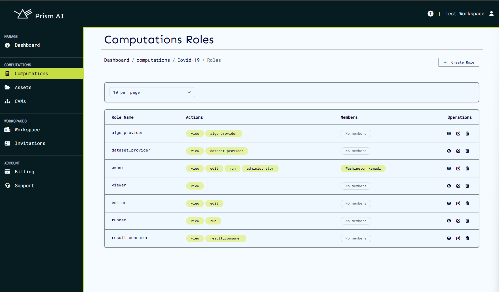
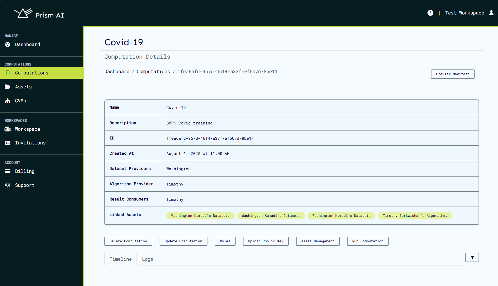
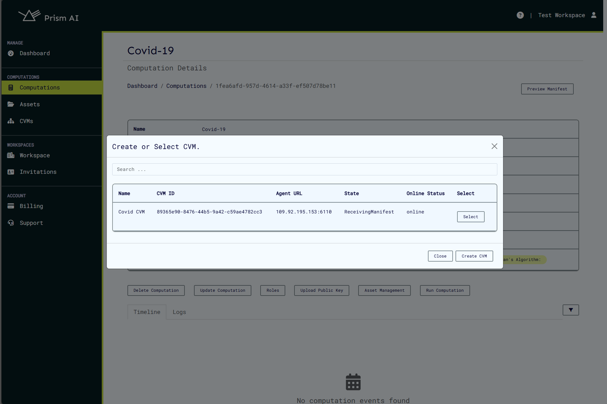
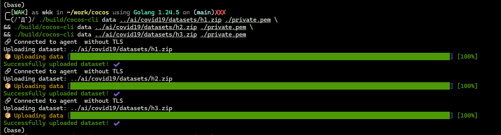
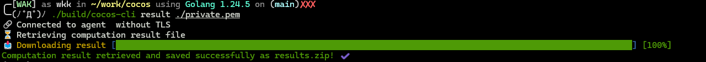

# Multiparty Computation for COVID-19 Training

This document outlines a **real-world example** of using Prism to run a **secure multiparty computation (MPC)**.  
In this scenario, multiple organizations contribute datasets to jointly run a **COVID-19 training algorithm** while keeping their data private.

---

## Overview

In this example, we will:

1. **Provision the Prism environment** — Set up the workspace, computation, billing, and roles.
2. **Prepare and register assets** — Upload datasets and algorithms to Prism.
3. **Create a CVM (Confidential Virtual Machine)** — Secure environment where computations are executed.
4. **Run the computation** — Trigger the MPC process with all required inputs.
5. **Consume the results** — Retrieve the computation output.

---

## 1. Provision the System on Prism

Before running any computation:

1. **Create a workspace** — A collaborative space for all computation participants.
2. **Create a computation** — Defines the specific task to run (e.g., COVID-19 prediction).
3. **Set up a billing account** — Required for usage tracking and payment.

📖 **Reference:** See the [Getting Started guide](/docs/getting-started.md) for step-by-step instructions.

Once provisioned:

- All participating organizations **must** be registered on Prism.
- The computation owner sends **workspace invitations** to all parties so they can upload their datasets or algorithms.

---

## 2. Creating & Provisioning the Computation

1. **Create the computation**
   - On the **Computations** page, click **New Computation**.
   - Fill in the required fields in the modal form.

   

2. **Initial state of a new computation**
   - No assets, asset providers, or result consumers are linked yet.
   - These must be **manually added by the computation admin**.

   

---

### Computation Roles

Each computation has **default roles** (e.g., Admin, Asset Provider, Result Consumer).

- Members must be **assigned to roles** before the computation can run.
- Roles control **permissions** (who can upload datasets, run computations, view results, etc.).



---

### Preparing the Assets

1. Prepare datasets following the guidelines in the  
   [AI Docs for COVID-19 testing](https://github.com/ultravioletrs/ai/tree/main/covid19#testing-with-cocos).

2. Upload each dataset to Prism:
   - Include the **file checksum** for verification.
   - Associate it with the computation.


---

A **fully provisioned computation** looks like this:



---

### Public & Private Keys

Before running the computation:

1. Generate a **public/private key pair**.
2. Upload the **public key** to Prism.
3. Use the **private key** when uploading assets to the CVM.

This ensures assets are **securely transmitted**.

---

## 3. Create a CVM

**CVMs (Confidential Virtual Machines)** are secure execution environments where computations run.

1. Navigate to the **CVMs** page.
2. Click **New CVM** and fill in the required details.


📖 **Reference:** See the [CVM documentation](/docs/cvms.md) for detailed setup instructions.

---

## 4. Running the Computation

Once the CVM is **created** and **online**:

1. Go to the **Computations** page.
2. Click **Run** on your computation.
3. In the modal, select the CVM you just created.



The computation will enter the **waiting** state until the algorithm and datasets are uploaded.


---

### Set CVM Agent URL

Export the CVM’s gRPC endpoint so the CLI can communicate with it:

```bash
export AGENT_GRPC_URL=109.92.195.153:6110
```

---

## 5. Uploading Assets

Assets are uploaded using the [Cocos CLI](https://docs.cocos.ultraviolet.rs/cli).

---

### Upload the Algorithm

If your algorithm is in **Python** and has dependencies:

```bash
export AGENT_GRPC_URL=109.92.195.153:6110
./build/cocos-cli algo ../ai/covid19/train.py ./private.pem \
  -a python \
  -r ../ai/covid19/requirements.txt
```

Result:


UI will update to show the transition from **Waiting for Algorithm** → **Waiting for Datasets**.


---

### Upload the Datasets

Example: Uploading three COVID-19 datasets:

```bash
./build/cocos-cli data ../ai/covid19/datasets/h1.zip ./private.pem \
&& ./build/cocos-cli data ../ai/covid19/datasets/h2.zip ./private.pem \
&& ./build/cocos-cli data ../ai/covid19/datasets/h3.zip ./private.pem
```

Result:



---

## 6. Computation Execution

Once all assets are uploaded:

- Logs and events appear on the computation’s **UI page** in real-time.
- Progress updates are sent as the computation runs.


When finished:

- A **Completed** event appears.
- Results are ready for consumption.


---

## 7. Consuming the Results

Once computation completes:

- Authorized **Result Consumers** can obtain the results using the CLI.
- Results can only be consumed once.

```bash
./build/cocos-cli result ./private.pem 
```

The response:


This also reflects on ui with an event to indicate the computation is complete:


