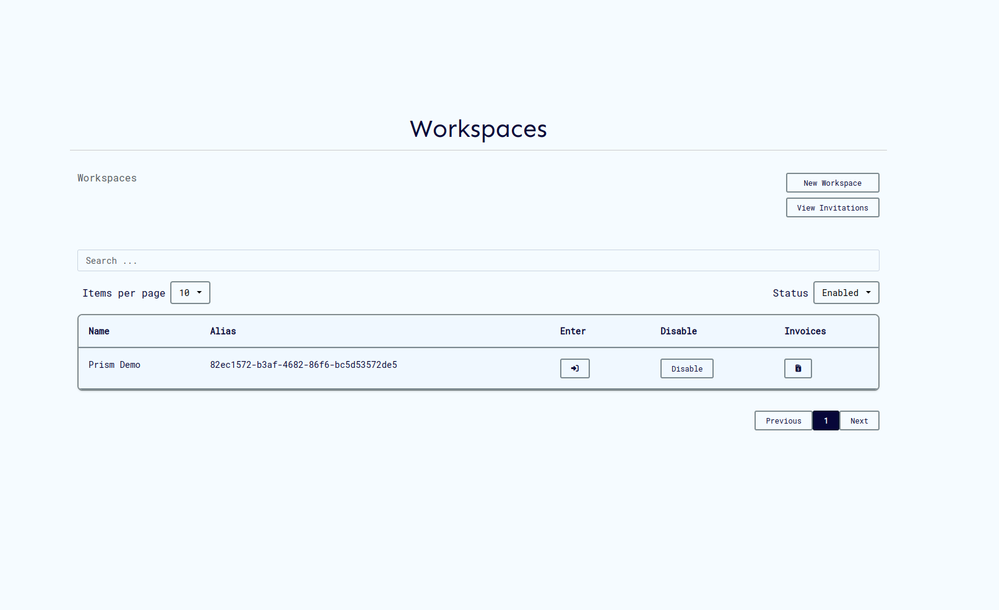
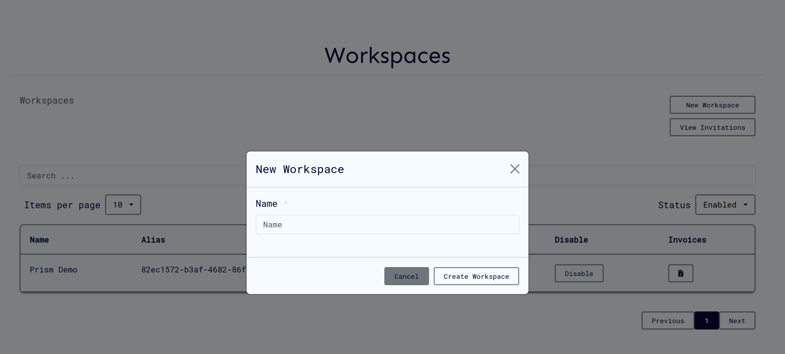
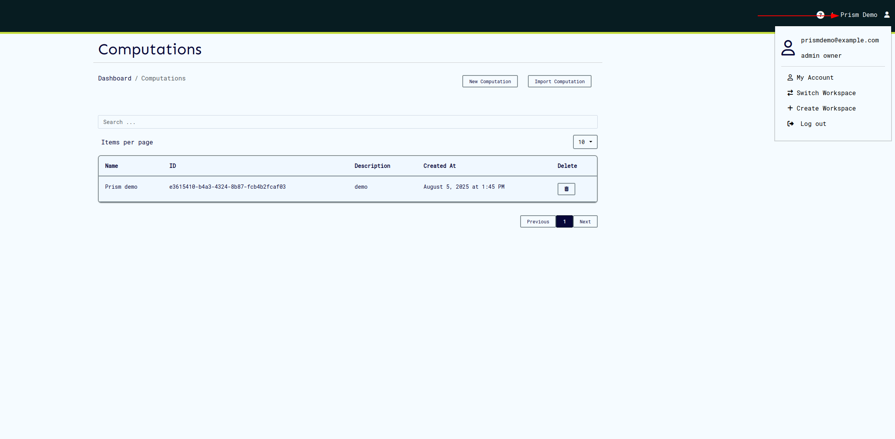

# Workspaces

Workspaces represent a consortium of users, computations, and resources that provides a single way to allow management of resources in the system. The workspaces / workspaces simplify access control by allowing only users who are in a particular workspace to access resources which they have been assigned to.

Within workspaces, different users have different roles that allow them to only perform certain operations within the workspace, such as creation of other users and other admin related tasks. A single user can belong to multiple workspaces, with which they can have different roles based on the policy assigned.

For any user to access the CoCoS system, they must be part of an workspace, and have to be signed in to the workspace.

## Create an workspace

On the ui the steps are as follows:

1. Log in to prism platform with a user with administrator permission.
2. On successfully log in, workspaces page is displayed. Click on 'New Workspace'.
   
3. Fill the required fields and click 'Create Workspace'
   

## Update workspace

On the ui the steps are as follows:

1. Click on 'Workspaces' on the navigation panel to view workspace details.
   

2. Click on 'Update Workspace' to navigate to the update workspace page.
3. Make necessary changes and click 'update'
   

## Get workspace

Viewing a workspace's details can be done as follows:

1. Click on 'Workspaces' on the navigation panel to view workspace details.
   

## Get workspaces

To view workspaces:

1. Click on user profile at the top right, then click on "Switch Workspaces" on the menu. This navigates to the workspaces page.
   
2. Workspace page is displayed.
   

## Assign

Adding a user to a workspace can be done as follows:

1. From Workspace details page, click on 'Members'. This navigates to Members page.
   

2. From Member page, click on 'Assign Member'. A modal dialog will appear that allowing member relation assignment.
   

## Members

Viewing the workspace members can be done as below

1. From Workspace details page, click on 'Members'. This navigates to Members page.
   
2. Workspace members page is displayed.
   
